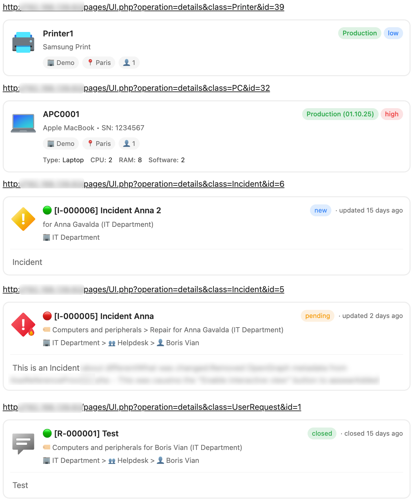
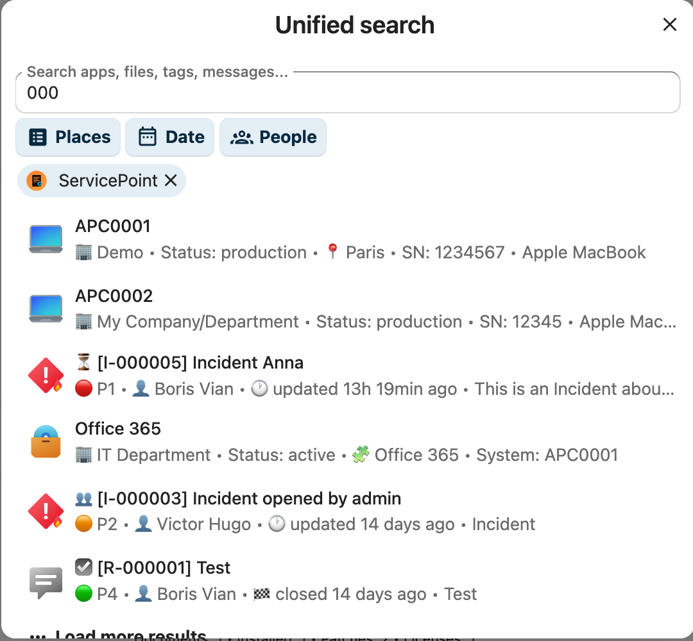
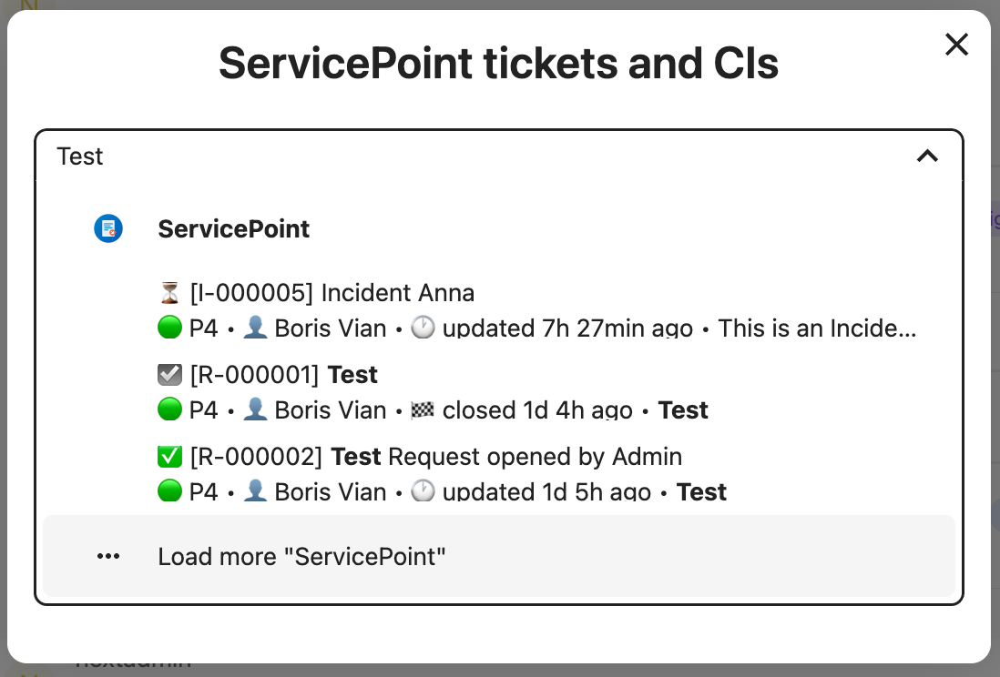
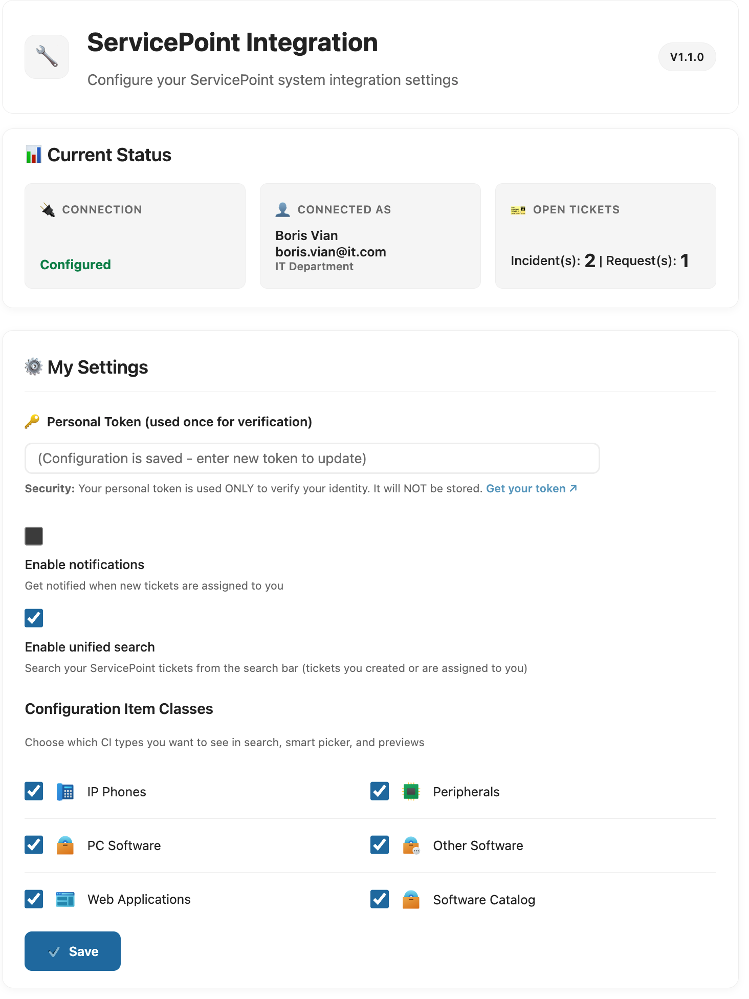
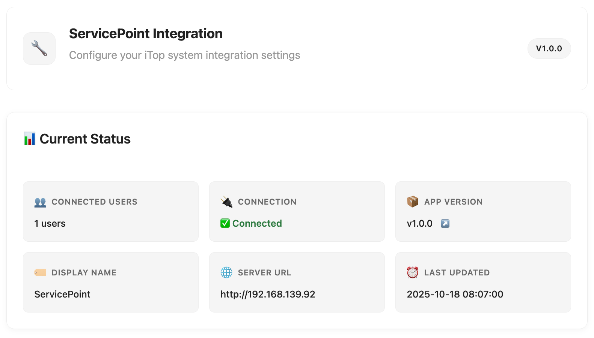
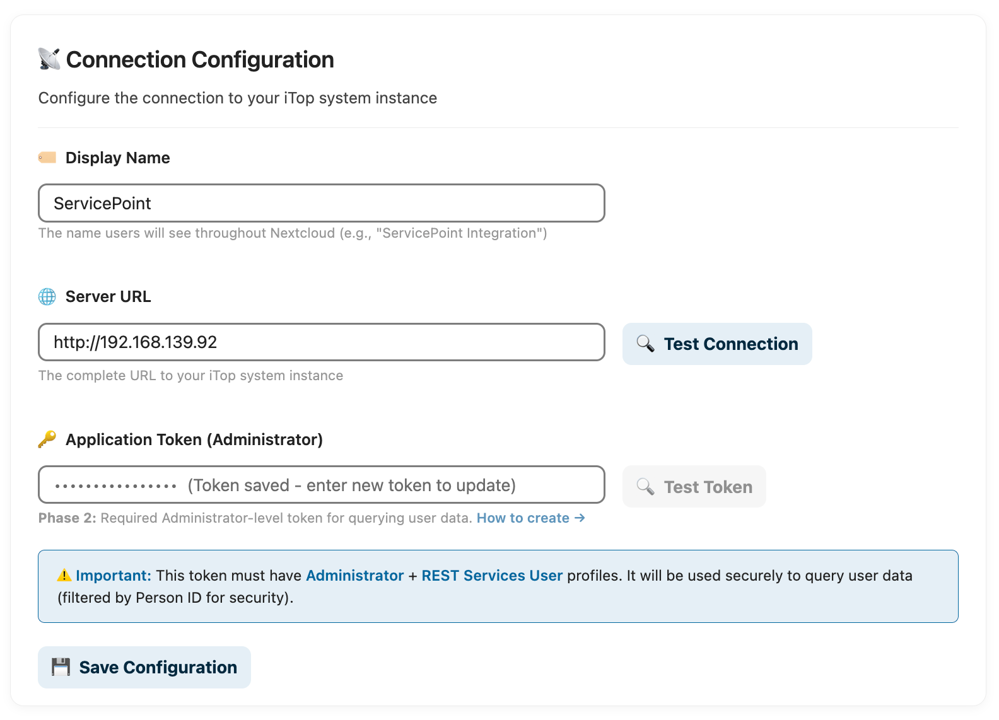
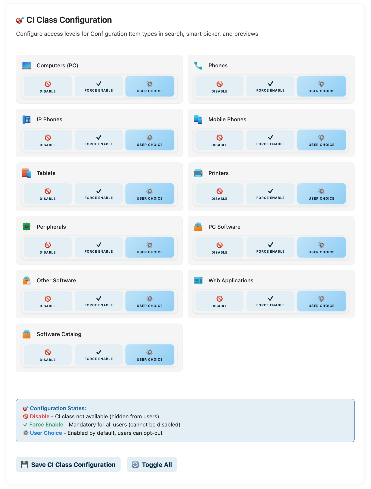
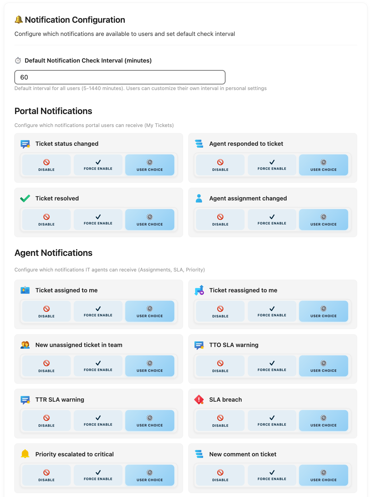

# iTop Integration for Nextcloud

🎟️ **Complete iTop ITSM & CMDB Integration** - Seamlessly access tickets, incidents, and Configuration Items from your Nextcloud environment

[](https://github.com/lexioj/integration_itop/releases)
[](LICENSE)
[](https://nextcloud.com)

A comprehensive Nextcloud integration that brings iTop IT Service Management and CMDB functionality directly into your collaboration platform. Users can search tickets, browse configuration items, and insert rich previews—all without leaving Nextcloud.

---

## ✨ Why Choose This Integration?

### **For End Users**
- 🔍 **Instant Search** - Find tickets and CIs from Nextcloud's search bar
- 🔗 **Rich Previews** - Paste iTop links anywhere for interactive previews
- 💬 **Smart Suggestions** - Get CI/ticket recommendations while typing in Talk or Text
- 📊 **Dashboard Widget** - See your ticket queue at a glance
- 🔔 **Notifications** - Get alerted when tickets are assigned to you

### **For IT Teams**
- 🏗️ **CMDB Access** - Browse Configuration Items (PCs, phones, printers, software)
- 👥 **Profile-Aware** - Portal users see only their assets; power users get full access
- 🔐 **Enterprise Security** - Dual-token architecture with encrypted storage
- ⚡ **High Performance** - Configurable caching (10s-1h TTLs)
- 🌍 **Multi-Language** - English, German (Du/Sie), French

### **For Administrators**
- ⚙️ **Granular Control** - Enable/disable CI classes per user or globally
- 📈 **Scalable** - Distributed caching for high-traffic deployments
- 🛡️ **Secure by Design** - Personal tokens never stored, Person ID filtering
- 🎨 **Professional UI** - Clean interface matching Nextcloud design standards

---

## 🚀 Key Features

### 🔗 Dynamic Reference Provider
Transform iTop links into rich, interactive previews across Nextcloud apps (Talk, Deck, Text, Collectives).



**What You Get:**
- **Tickets**: Status, priority, assignee, caller, description, timestamps
- **Configuration Items**: Hardware specs (CPU, RAM), software details, contact count
- **Smart Icons**: State-specific ticket icons (closed, escalated, deadline)
- **CI Icons**: Class-specific icons for all 11 CI types (PC, phone, printer, etc.)
- **Universal Support**: Works across all Nextcloud apps supporting rich content

### 🔍 Unified Search Integration
Search your iTop tickets **and Configuration Items** directly from Nextcloud's unified search bar.



**Search Capabilities:**
- **Tickets**: UserRequest, Incident - by title, description, reference number
- **Configuration Items**: PC, Phone, Tablet, Printer, Software, WebApplication
- **Smart Ranking**: Exact matches first, then class weighting, then recency
- **Profile-Aware**: Portal users see only related CIs; power users get full CMDB
- **Real-Time Status**: Live priority badges and status indicators
- **Performance**: Results cached (30s default) for instant response

### 🎯 Smart Picker Integration
Quick access to tickets and CIs when creating documents or chatting.



**Features:**
- **Context-Aware Suggestions**: Recent tickets and CIs based on your work
- **Dual Search**: Find both tickets and Configuration Items
- **Rich Insertion**: Insert links that automatically become interactive previews
- **Talk/Text Integration**: Works seamlessly in chat and document editing
- **Debounced Queries**: Performance-optimized with intelligent caching

### 📊 Configuration Item (CI) Browsing

**NEW in v1.1.0** - Complete CMDB integration with 11 supported CI classes:

#### End User Devices
- **PC** - Desktops and laptops with hardware specs (CPU, RAM, OS)
- **Phone/IPPhone/MobilePhone** - Telephony devices with phone numbers and IMEI
- **Tablet** - Mobile tablet devices
- **Printer** - Network and local printers
- **Peripheral** - Monitors, keyboards, mice, and other peripherals

#### Software & Applications
- **PCSoftware** - Desktop/server software with version and license info
- **OtherSoftware** - Miscellaneous software installations
- **WebApplication** - Web-based applications with URLs

**Profile-Based Permissions:**
- **Portal Users**: See only CIs where they are listed as contacts (strict filtering)
- **Power Users**: Full CMDB access within iTop ACL permissions
- **Configurable**: Admins control which CI classes are searchable

### ⚙️ Personal Settings Dashboard
Professional user configuration with real-time status monitoring.



**Your Control Panel:**
- **Connection Status**: Real-time indicator with connectivity testing
- **User Profile**: See your iTop identity (name, email, organization, profiles)
- **Ticket Counter**: Open incidents and user requests at a glance
- **Secure Setup**: Token-based authentication with one-time personal token validation
- **Feature Toggles**: Enable/disable search and notifications individually
- **Clean Interface**: Professional theme-aware design

### 🛠️ Admin Configuration Panel
Comprehensive administration interface for system-wide configuration.





**Administrative Features:**
- **Connection Management**: iTop URL, display name, application token (encrypted)
- **CI Class Configuration**: Enable/disable CI classes with 3-state control:
  - **Disabled**: CI class hidden from all users
  - **Forced**: Enabled for all users (no opt-out)
  - **User Choice**: Enabled but users can opt-out in personal settings
- **Cache Performance Tuning**: Configurable TTLs for all cache types
  - CI Preview Cache: 10s-1h (default: 60s)
  - Ticket Info Cache: 10s-1h (default: 60s)
  - Search Results Cache: 10s-5min (default: 30s)
  - Smart Picker Cache: 10s-5min (default: 60s)
  - Profile Cache: 10s-1h (default: 30min)
- **Cache Management**: Clear all cache button for immediate refresh
- **Connection Testing**: Real-time validation of server connectivity
- **User Monitoring**: See how many users are connected
- **Professional UI**: Clean, theme-aware interface

---

## 🔐 Security Architecture

### Dual-Token Approach
**Maximum security with user convenience:**

**Application Token** (Admin-configured)
- Administrator-level token stored encrypted
- Used for all iTop API queries
- Never exposed to end users
- Rotatable without disrupting user sessions

**Personal Token** (User-provided)
- Provided once during setup for identity verification
- **Never stored** - discarded immediately after validation
- Maps Nextcloud user to iTop Person ID
- Supports Portal users via [iTop Portal Personal Tokens Extension](https://github.com/LexioJ/itop-portal-personal-tokens)

### Data Isolation
- **Person ID Filtering**: All queries filtered by user's Person ID
- **Profile-Based Access**: Portal vs power user detection with caching
- **No Data Leakage**: Users only see their own tickets and permitted CIs
- **Encrypted Storage**: Application token encrypted with Nextcloud ICrypto
- **Audit Trail**: All API calls logged with user context

---

## 📦 Installation

### Prerequisites
- **Nextcloud**: 30.0 or higher
- **iTop Server**: 3.0+ with REST API enabled
- **PHP**: 8.1 or higher
- **Optional**: [iTop Portal Personal Tokens Extension](https://github.com/LexioJ/itop-portal-personal-tokens) (for Portal user support)

### Quick Setup

#### Step 1: Install the App
```bash
# Place in apps directory
cd /path/to/nextcloud/apps
git clone https://github.com/lexioj/integration_itop.git
cd integration_itop

# Install dependencies and build
composer install --no-dev
npm install
npm run build

# Enable the app
sudo -u www-data php /path/to/nextcloud/occ app:enable integration_itop
```

#### Step 2: Admin Configuration
1. Navigate to **Settings → Administration → iTop Integration**
2. **Create Application Token in iTop**:
   - Login as Administrator
   - Go to **Admin Tools → User Accounts → + New... → Application Token**
   - Configure:
     - **Person**: Select admin user
     - **Profiles**: ✅ **Administrator** + ✅ **REST Services User**
     - **Remote Application**: "Nextcloud Integration"
     - **Scope**: ✅ **REST/JSON**
   - Save and copy the generated token (shown only once!)
3. **Configure in Nextcloud**:
   - **iTop Server URL**: `https://itop.company.com`
   - **Application Token**: Paste the token from step 2
   - **User-Facing Name**: Customize display name (default: "iTop")
   - Click **Test Connection** to verify
4. **Configure CI Classes** (optional):
   - Enable/disable specific CI classes
   - Set access levels (disabled/forced/user_choice)
5. **Tune Performance** (optional):
   - Adjust cache TTLs based on your environment
   - Default values work for most deployments

#### Step 3: User Setup
Each user must create a personal token for identity verification:

**For Portal Users** (requires [Portal Personal Tokens Extension](https://github.com/LexioJ/itop-portal-personal-tokens)):
1. Login to iTop Portal
2. Go to **My Profile → Personal Tokens**
3. Create token with **REST/JSON** scope
4. Copy token immediately

**For Regular Users**:
1. Login to iTop
2. Go to **My Account → Personal Tokens**
3. Create token:
   - **Scope**: ✅ **REST/JSON**
   - **Expiration**: Never or set expiration
4. Copy token immediately

**In Nextcloud**:
1. Go to **Settings → Personal → iTop Integration**
2. Paste your personal token
3. Click **Save** - token validates your identity and is discarded
4. View your dashboard with real-time status

---

## 🏗️ Technical Architecture

### Core Components

```
lib/
├── AppInfo/
│   └── Application.php              # App bootstrap, CI class configuration
├── Controller/
│   ├── ConfigController.php         # Settings, validation, cache management
│   └── ItopAPIController.php        # REST endpoints for tickets/CIs
├── Service/
│   ├── ItopAPIService.php           # Core iTop REST API integration
│   ├── ProfileService.php           # Portal vs power user detection (cached)
│   ├── PreviewMapper.php            # Transform iTop objects → preview DTOs
│   └── CacheService.php             # Distributed caching layer
├── Reference/
│   └── ItopReferenceProvider.php    # Rich link previews (tickets + CIs)
├── Search/
│   └── ItopSearchProvider.php       # Unified search (tickets + CIs)
├── Dashboard/
│   └── ItopWidget.php               # Dashboard widget
├── Settings/
│   ├── Admin.php                    # Admin configuration panel
│   └── Personal.php                 # User settings interface
└── Notification/
    └── Notifier.php                 # Notification system

src/
└── views/
    └── ReferenceItopWidget.vue      # Rich preview Vue component
```

### API Integration
- **REST API Version**: 1.3+
- **Authentication**: Token-based (Auth-Token header)
- **Query Method**: POST with form-encoded JSON data
- **Response Format**: JSON with object arrays
- **Security**: All queries filtered by Person ID
- **Caching**: Multi-layer with configurable TTLs

### Supported iTop Objects
- **Tickets**: UserRequest, Incident
- **Configuration Items**: PC, Phone, IPPhone, MobilePhone, Tablet, Printer, Peripheral, PCSoftware, OtherSoftware, WebApplication, Software
- **Persons**: User profile information
- **Organizations**: Company/department info

---

## 🌍 Internationalization (l10n)

**280 translatable strings** across the entire application:

### Supported Languages
- **English** (en) - Base language
- **German Informal** (de) - Du-form for casual environments
- **German Formal** (de_DE) - Sie-form for professional environments
- **French** (fr) - Formal vous-form

### Translation Coverage
- Admin settings (all labels, hints, errors)
- Personal settings (status messages, forms)
- Search results and previews
- Error messages and validation
- Cache settings and CI classes
- Time formats and relative dates

### Contributing Translations
See [docs/l10n.md](docs/l10n.md) for translation guidelines and process.

---

## 🔧 Performance Tuning

### Cache Configuration
Adjust cache TTLs in **Admin Settings → Cache & Performance**:

**Development/Testing** (frequent changes):
- CI Preview: 10s
- Search Results: 10s
- Profile Cache: 60s

**Production (stable)** (balance):
- CI Preview: 60s (default)
- Search Results: 30s (default)
- Profile Cache: 30min (default)

**High-Traffic** (performance priority):
- CI Preview: 1h
- Search Results: 5min
- Profile Cache: 1h

**Shared CMDB** (freshness priority):
- CI Preview: 10s
- Search Results: 10s
- Profile Cache: 5min

### Recommended Settings
- **Small Deployments** (<100 users): Use defaults
- **Medium Deployments** (100-1000 users): Increase CI/Profile cache to 5-15min
- **Large Deployments** (>1000 users): Max out cache TTLs, use dedicated Redis

---

## 📋 What's New in v1.1.0

**Major New Feature: Configuration Item (CI) Browsing** 🎉

### Added
- **CI Support in Search**: Search 11 CI classes from unified search bar
- **CI Support in Smart Picker**: Insert CI references in Talk, Text, and comments
- **CI Rich Previews**: Paste CI URLs for detailed hardware/software previews
- **Profile Service**: Automatic Portal vs Power user detection with 30min caching
- **Preview Mapper**: Dedicated service for efficient CI data transformation
- **Cache Service**: Distributed caching layer with configurable TTLs
- **Admin CI Configuration**: Enable/disable CI classes with 3-state control
- **Cache Management**: Admin UI with configurable TTLs and clear cache button
- **11 CI Icons**: Class-specific icons (PC, Phone, Tablet, Printer, Software, etc.)
- **French Translation**: Complete fr.json with all 280 strings (formal vous-form)
- **German Translations**: Informal (du.json) and formal (de_DE.json) variants

### Changed
- **Admin Settings**: Refactored to PHP-rendered HTML for better translation support
- **Search Provider**: Enhanced with CI class ranking and profile-aware filtering
- **Reference Provider**: Extended to detect and preview CI URLs
- **API Service**: New methods for CI queries with Person ID filtering
- **Performance**: Reduced API calls by 60-80% with multi-layer caching

### Technical Improvements
- ProfileService with configurable cache (10s-1h, default 30min)
- CacheService with 5 configurable TTL types
- PreviewMapper with PhysicalDevice field alignment
- CI class state management (disabled/forced/user_choice)
- Improved mobile responsiveness for CI previews

See [CHANGELOG.md](CHANGELOG.md) for complete details.

---

## 🆘 Support & Troubleshooting

### Common Issues

**Connection failed**
- ✅ Verify iTop server URL is correct and accessible
- ✅ Check application token has Administrator + REST Services User profiles
- ✅ Ensure iTop REST API is enabled (`allow_rest_services_via_tokens`)

**User not configured**
- ✅ Create personal token with REST/JSON scope
- ✅ Verify token was saved successfully in personal settings
- ✅ Check Nextcloud logs for validation errors

**Search not working**
- ✅ Ensure person_id is configured (check personal settings)
- ✅ Verify search is enabled in personal settings
- ✅ Check CI classes are enabled in admin settings

**Links not previewing**
- ✅ Clear browser cache and Nextcloud cache
- ✅ Verify URL matches iTop instance configured
- ✅ Check if user has permission to view the ticket/CI

**Portal users can't see CIs**
- ✅ Portal users only see CIs where they are listed as contacts
- ✅ Verify contact assignments in iTop
- ✅ Check ProfileService cache hasn't expired

### Debugging
```bash
# Check Nextcloud logs
tail -f /path/to/nextcloud/data/nextcloud.log | grep itop

# Clear application cache
sudo -u www-data php occ config:app:delete integration_itop cache_ttl_ci_preview

# Test iTop API connectivity
curl -X POST https://itop.company.com/webservices/rest.php \
  -H "Auth-Token: YOUR_TOKEN" \
  -d "json_data={\"operation\":\"list_operations\"}"
```

### Getting Help
- 📖 **Documentation**: [docs/](docs/)
- 🐛 **Bug Reports**: [GitHub Issues](https://github.com/lexioj/integration_itop/issues)
- 💬 **Discussions**: [GitHub Discussions](https://github.com/lexioj/integration_itop/discussions)
- 📧 **Email**: See [CONTRIBUTING.md](CONTRIBUTING.md)

---

## 🗺️ Roadmap

### v1.2.0 (Next Release)
- [ ] Enhanced Dashboard Widget with charts and filters
- [ ] Ticket activity timeline in previews
- [ ] Advanced search filters (date ranges, custom fields)

### Future
- [ ] Ticket creation from Nextcloud
- [ ] CI relationship browser (dependencies, impacts)
- [ ] Enhanced notification system with email digest
- [ ] Additional CI classes (Server, VirtualMachine, Network Device)
- [ ] API rate limiting improvements
- [ ] More languages (Spanish, Italian, Dutch, Portuguese)

---

## 🤝 Contributing

Contributions are welcome! Please see [CONTRIBUTING.md](CONTRIBUTING.md) for guidelines.

### Development Setup
```bash
# Clone the repository
git clone https://github.com/lexioj/integration_itop.git
cd integration_itop

# Install dependencies
composer install
npm install

# Start development build (watch mode)
npm run dev

# Run tests
composer test
npm run test
```

### Translation Contributions
We especially welcome translations! See [docs/l10n.md](docs/l10n.md) for the complete translation guide.

---

## 📄 License

This project is licensed under the **AGPL v3 License** - see the [LICENSE](LICENSE) file for details.

---

## 🙏 Acknowledgments

- **Nextcloud Community** for the amazing collaboration platform
- **iTop/Combodo** for the powerful ITSM solution
- **Contributors** who helped with translations, testing, and feedback

---

**Transform your ITSM workflow** • Made with ❤️ for the Nextcloud and iTop communities

[](https://github.com/lexioj/integration_itop)
[](https://github.com/lexioj/integration_itop/issues)
[](https://github.com/lexioj/integration_itop/issues)