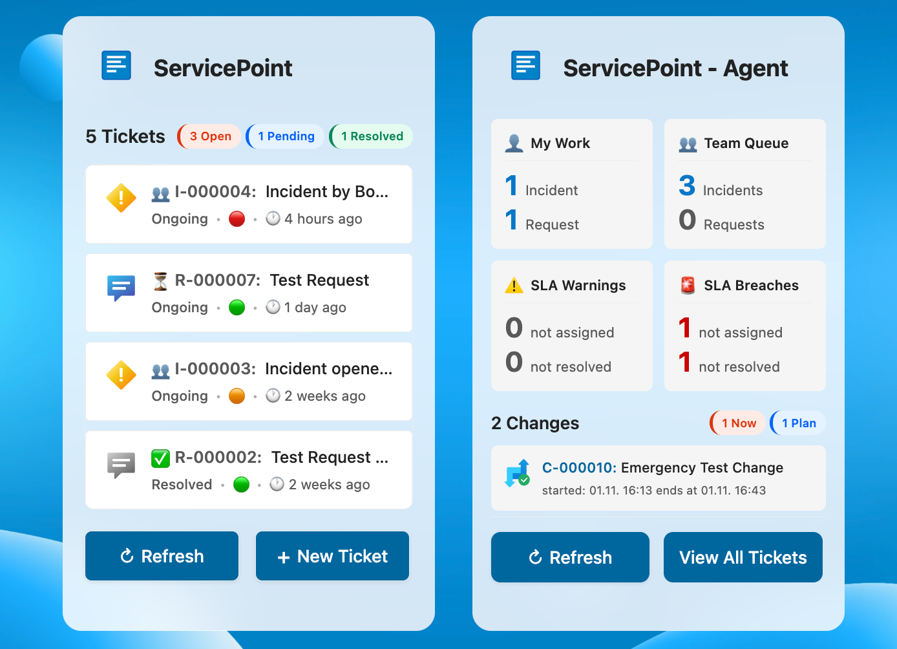
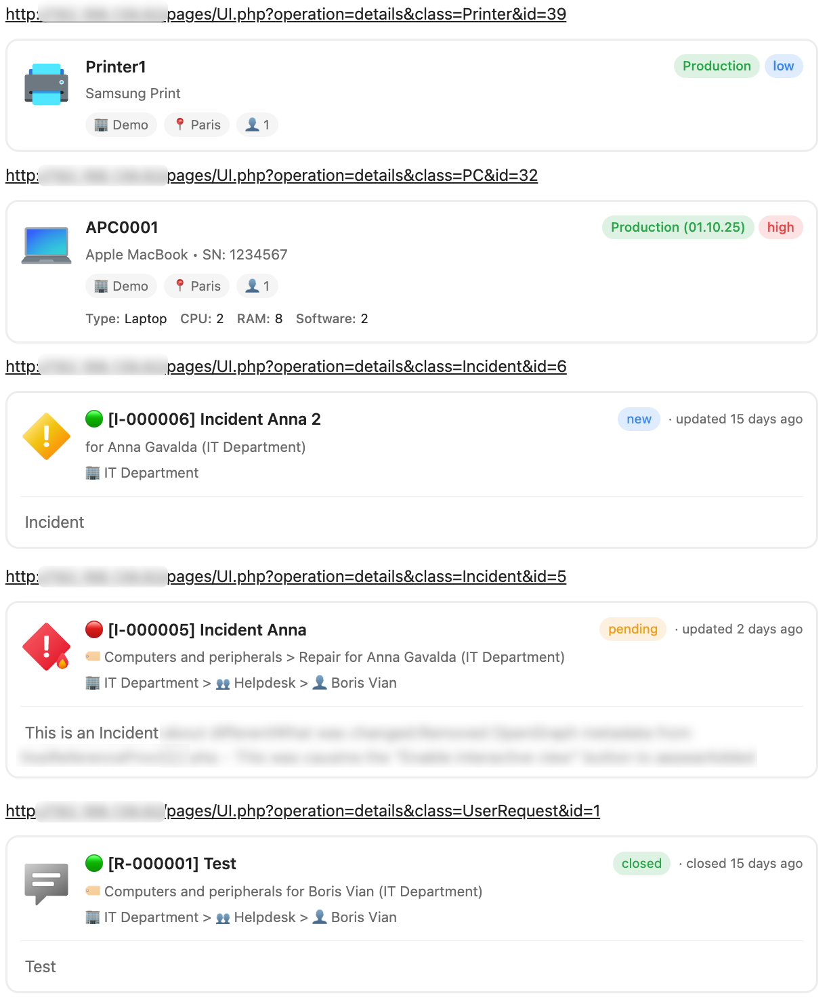
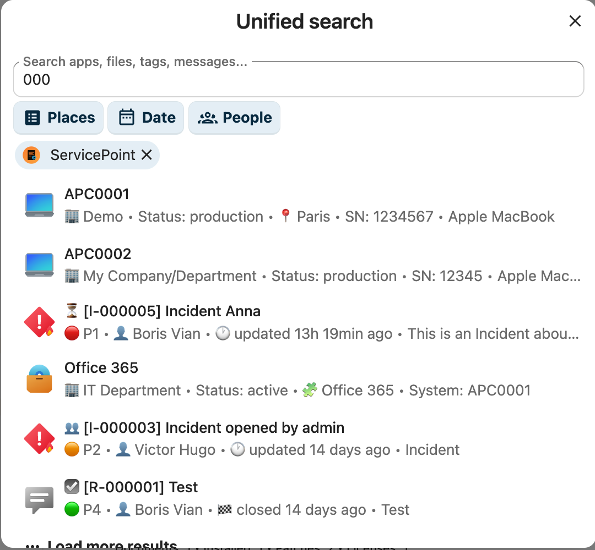
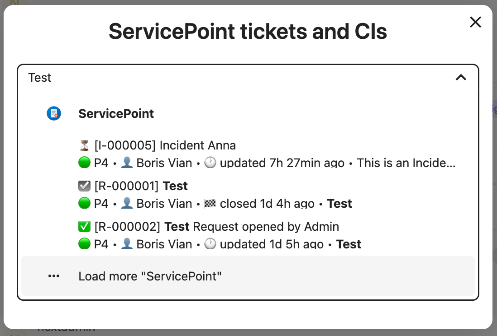
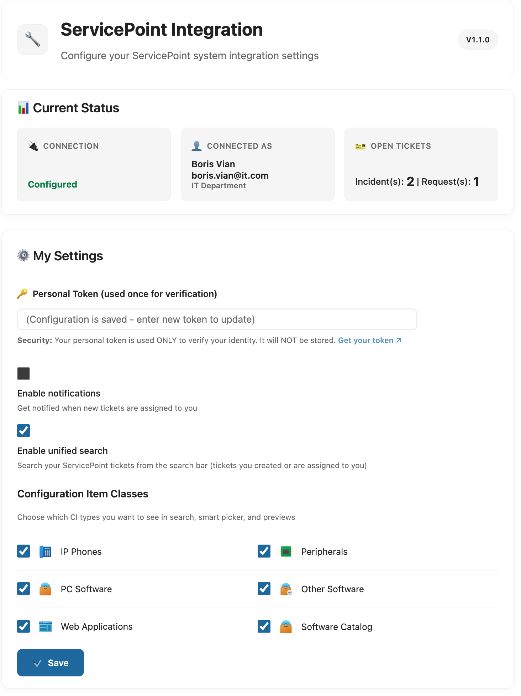
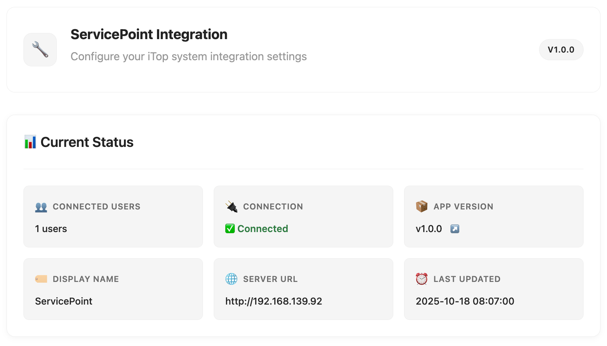
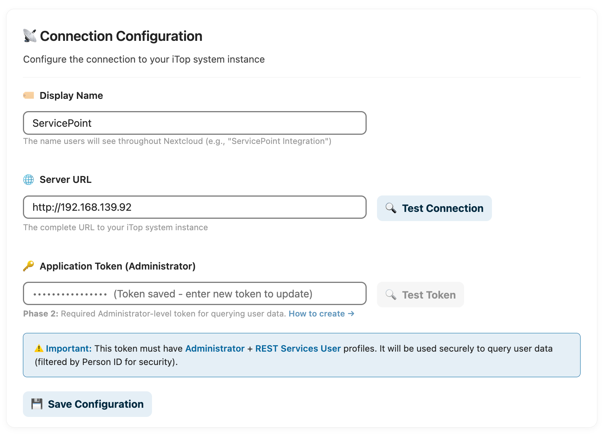
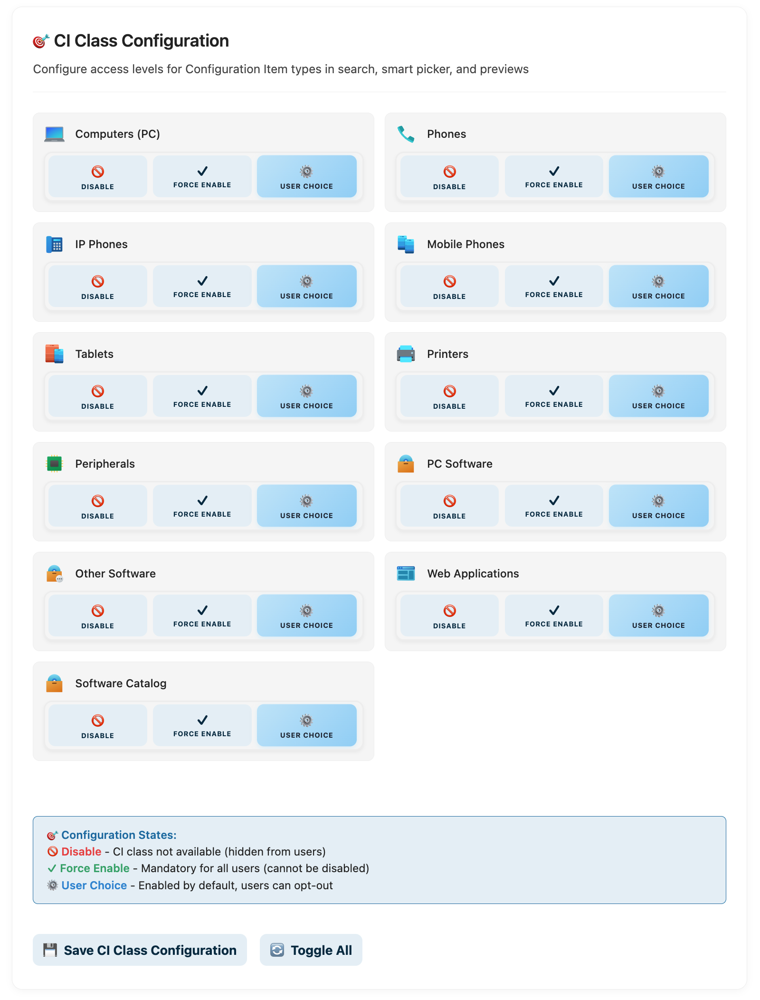
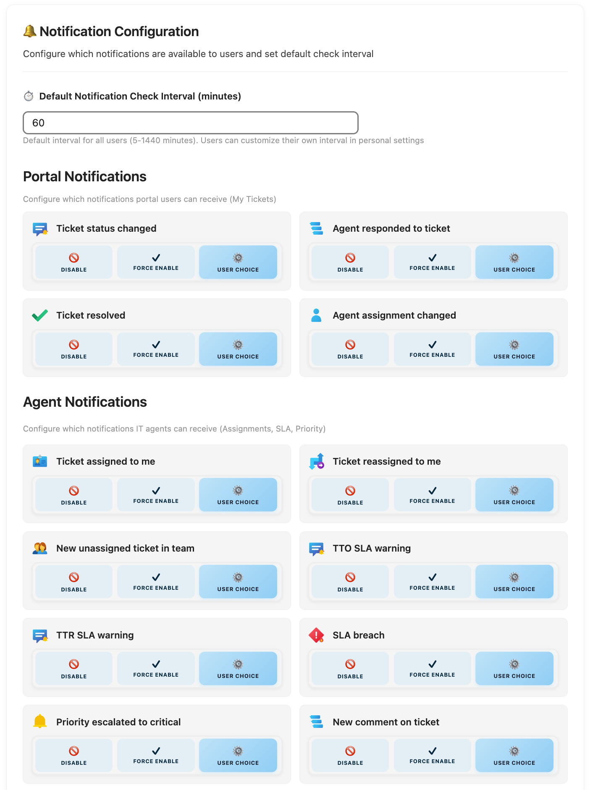
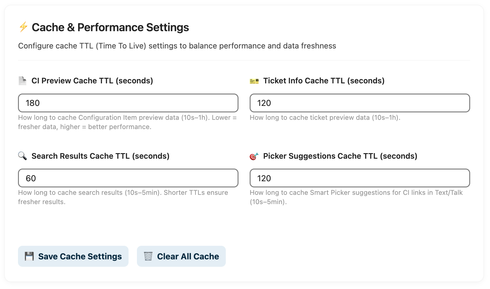

# iTop Integration for Nextcloud

🎟️ **Complete iTop ITSM & CMDB Integration** - Seamlessly access tickets, incidents, and Configuration Items from your Nextcloud environment

[](https://github.com/lexioj/integration_itop/releases)
[](LICENSE)
[](https://nextcloud.com)

A comprehensive Nextcloud integration that brings iTop IT Service Management and CMDB functionality directly into your collaboration platform. Users can search tickets, browse configuration items, and insert rich previews—all without leaving Nextcloud.

---

## ✨ Why Choose This Integration?

### **For End Users**
- 🔍 **Instant Search** - Find tickets and CIs from Nextcloud's search bar
- 🔗 **Rich Previews** - Paste iTop links anywhere for interactive previews
- 💬 **Smart Suggestions** - Get CI/ticket recommendations while typing in Talk or Text
- 📊 **Dashboard Widgets** - Portal widget for personal tickets + Agent widget for operational metrics
- 🔔 **Smart Notifications** - 12 notification types with weekend-aware SLA warnings (Portal + Agent tracks)

### **For IT Teams**
- 🏗️ **CMDB Access** - Browse Configuration Items (PCs, phones, printers, software)
- 👥 **Profile-Aware** - Portal users see only their assets; power users get full access
- 🔐 **Enterprise Security** - Dual-token architecture with encrypted storage
- ⚡ **High Performance** - Configurable caching (10s-1h TTLs)
- 🌍 **Multi-Language** - English, German (Du/Sie), French

### **For Administrators**
- ⚙️ **Granular Control** - Enable/disable CI classes per user or globally
- 📈 **Scalable** - Distributed caching for high-traffic deployments
- 🛡️ **Secure by Design** - Personal tokens never stored, Person ID filtering
- 🎨 **Professional UI** - Clean interface matching Nextcloud design standards

---

## 🚀 Key Features

### 📊 Interactive Dashboard Widgets

Get comprehensive overviews of your ticket queue directly on your Nextcloud dashboard. The integration provides **two specialized widgets** that adapt to your user profile:



#### 🎫 Portal Widget - "iTop"
**For All Users** - Track your personal tickets at a glance

**Features:**
- **Compact Status Overview**: See total tickets with badge breakdown (open, escalated, pending, resolved)
- **Recent Ticket Feed**: Display 4 most recent tickets sorted by last update
- **Visual Status Indicators**: State-specific SVG icons (new, escalated, deadline, closed) for both Incidents and UserRequests
- **Inline Metadata**: Status emoji (🆕👥⏳⚠️✅☑️❌), priority emoji (🔴🟠🟡🟢), and relative timestamps with tooltips
- **Rich Hover Details**: Comprehensive ticket information on hover including reference, dates, and sanitized description
- **One-Click Access**: Click any ticket to open directly in iTop
- **Quick Actions**: Refresh dashboard and create new tickets without leaving Nextcloud
- **Responsive Design**: Mobile-optimized layout adapts to all screen sizes

#### 👨‍💼 Agent Widget - "iTop - Agent Dashboard"
**For Agent Users Only** - Comprehensive operational dashboard

**Features:**
- **My Work**: Count of assigned incidents and requests
- **Team Queue**: Team-wide ticket counts (incidents and requests)
- **SLA Tracking**:
  - SLA Warnings (TTO/TTR approaching)
  - SLA Breaches (TTO/TTR exceeded)
- **Change Management**:
  - Upcoming changes with time windows
  - Emergency/Normal/Routine change types
  - Current and planned change status
- **Quick Navigation**: Click metrics to jump to filtered iTop views
- **Real-Time Counts**: Live ticket counts with visual indicators (info, warning, error)
- **Responsive Grid**: 2x2 metrics layout adapting to screen size

**Widget Visibility:**
- **Portal Users** (is_portal_only = true): See only Portal Widget
- **Agent Users** (is_portal_only = false): See both Portal Widget and Agent Widget
- Automatically controlled by iTop user profiles

**Perfect for:**
- **Portal Widget**: End users tracking their personal requests
- **Agent Widget**: IT agents managing workload, SLA compliance, and team coordination
- **Both**: Managers needing both personal and operational views

### 🔗 Dynamic Reference Provider
Transform iTop links into rich, interactive previews across Nextcloud apps (Talk, Deck, Text, Collectives).



**What You Get:**
- **Tickets**: Status, priority, assignee, caller, description, timestamps
- **Configuration Items**: Hardware specs (CPU, RAM), software details, contact count
- **Smart Icons**: State-specific ticket icons (closed, escalated, deadline)
- **CI Icons**: Class-specific icons for all CI types (built-in + custom with appdata caching)
- **Universal Support**: Works across all Nextcloud apps supporting rich content

### 🔍 Unified Search Integration
Search your iTop tickets **and Configuration Items** directly from Nextcloud's unified search bar.



**Search Capabilities:**
- **Tickets**: UserRequest, Incident - by title, description, reference number
- **Configuration Items**: 11 built-in CI classes + admin-configurable custom classes (Cluster, NetworkDevice, etc.)
- **Smart Ranking**: Exact matches first, then class weighting, then recency
- **Profile-Aware**: Portal users see only related CIs; power users get full CMDB
- **Real-Time Status**: Live priority badges and status indicators
- **Performance**: Results cached (30s default) for instant response

### 🎯 Smart Picker Integration
Quick access to tickets and CIs when creating documents or chatting.



**Features:**
- **Context-Aware Suggestions**: Recent tickets and CIs based on your work
- **Dual Search**: Find both tickets and Configuration Items
- **Rich Insertion**: Insert links that automatically become interactive previews
- **Talk/Text Integration**: Works seamlessly in chat and document editing
- **Debounced Queries**: Performance-optimized with intelligent caching

### 📊 Configuration Item (CI) Browsing

**CI Browsing since v1.1.0, Custom Classes since v1.4.0** - Complete CMDB integration with 11 built-in CI classes plus admin-configurable custom classes:

#### End User Devices
- **PC** - Desktops and laptops with hardware specs (CPU, RAM, OS)
- **Phone/IPPhone/MobilePhone** - Telephony devices with phone numbers and IMEI
- **Tablet** - Mobile tablet devices
- **Printer** - Network and local printers
- **Peripheral** - Monitors, keyboards, mice, and other peripherals

#### Software & Applications
- **PCSoftware** - Desktop/server software with version and license info
- **OtherSoftware** - Miscellaneous software installations
- **WebApplication** - Web-based applications with URLs

#### Custom CI Classes (v1.4.0)
- **Admin-Configurable**: Add any iTop FunctionalCI subclass (Cluster, Monitor, NetworkDevice, etc.) from admin settings
- **Icon Support**: Custom class icons fetched from iTop datamodel and cached in appdata; Peripheral.svg as fallback
- **Full Integration**: Custom classes work in search, smart picker, reference provider, and personal settings

**Profile-Based Permissions:**
- **Portal Users**: See only CIs where they are listed as contacts (strict filtering)
- **Power Users**: Full CMDB access within iTop ACL permissions
- **Configurable**: Admins control which CI classes are searchable

### 🔔 Intelligent Notification System
**NEW in v1.3.0** - Comprehensive notification system with 12 types across Portal and Agent tracks.

**Portal Notifications** (4 types for all users):
- `ticket_status_changed` - Track ticket lifecycle from new to resolved
- `ticket_resolved` - Resolution notifications
- `agent_assigned` - When an agent is assigned to your ticket
- `agent_responded` - New public comments from IT agents

**Agent Notifications** (8 types for IT staff):
- `team_unassigned_new` - New unassigned tickets in your team's queue
- `ticket_assigned` / `ticket_reassigned` - Ticket assignment changes
- `ticket_tto_warning` / `ticket_ttr_warning` - SLA warnings with escalating urgency (⏰ 24h → ⚠️ 12h → 🟠 4h → 🔴 1h)
- `ticket_sla_breach` - SLA deadline exceeded alerts
- `ticket_priority_critical` - Critical priority escalations
- `ticket_comment` - All comments on your tickets (public + private)

**Smart Features:**
- **Weekend-Aware**: Friday uses 72h threshold, Saturday 48h to catch Monday/Tuesday breaches
- **Zero Duplicates**: Crossing-time algorithm prevents repeated warnings for same SLA level
- **Configurable Intervals**: Check frequency from 5-1440 minutes (default: 15 min)
- **3-State Control**: Admin can set notifications as Disabled/Forced/User Choice
- **Profile-Based**: Portal users see only portal notifications; agents get both tracks

See [docs/NOTIFICATIONS.md](docs/NOTIFICATIONS.md) for complete setup and troubleshooting guide.

### ⚙️ Personal Settings Dashboard
Professional user configuration with real-time status monitoring.



**Your Control Panel:**
- **Connection Status**: Real-time indicator with connectivity testing
- **User Profile**: See your iTop identity (name, email, organization, profiles)
- **Ticket Counter**: Open incidents and user requests at a glance
- **Secure Setup**: Token-based authentication with one-time personal token validation
- **Feature Toggles**: Enable/disable search, portal notifications, agent notifications, and newsroom mirroring individually
- **Granular Control**: Per-notification-type toggles for User Choice notifications
- **Clean Interface**: Professional theme-aware design

### 🛠️ Admin Configuration Panel
Comprehensive administration interface for system-wide configuration.






**Administrative Features:**
- **Connection Management**: iTop URL, display name, application token (encrypted)
- **Ticket System Type**: ITIL (UserRequest + Incident), Simple (UserRequest only), or Auto-detect
- **Custom CI Classes**: Discover and add iTop classes beyond the 11 built-in types with icon support
- **CI Class Configuration**: Enable/disable CI classes with 3-state control:
  - **Disabled**: CI class hidden from all users
  - **Forced**: Enabled for all users (no opt-out)
  - **User Choice**: Enabled but users can opt-out in personal settings
- **Notification Configuration**: Enable/disable Notifications with 3-state control:
  - **Disabled**: Notification is hidden from all users
  - **Forced**: Enabled for all users (no opt-out)
  - **User Choice**: Enabled but users can opt-out in personal settings
- **Cache Performance Tuning**: Configurable TTLs for all cache types
  - CI Preview Cache: 10s-1h (default: 60s)
  - Ticket Info Cache: 10s-1h (default: 60s)
  - Search Results Cache: 10s-5min (default: 30s)
  - Smart Picker Cache: 10s-5min (default: 60s)
  - Profile Cache: 10s-1h (default: 30min)
- **Cache Management**: Clear all cache button for immediate refresh
- **Connection Testing**: Real-time validation of server connectivity
- **User Monitoring**: See how many users are connected
- **Professional UI**: Clean, theme-aware interface

---

## 🔐 Security Architecture

### Dual-Token Approach
**Maximum security with user convenience:**

**Application Token** (Admin-configured)
- Administrator-level token stored encrypted
- Used for all iTop API queries
- Never exposed to end users
- Rotatable without disrupting user sessions

**Personal Token** (User-provided)
- Provided once during setup for identity verification
- **Never stored** - discarded immediately after validation
- Maps Nextcloud user to iTop Person ID
- Supports Portal users via [iTop Portal Personal Tokens Extension](https://github.com/LexioJ/itop-portal-personal-tokens)

### Data Isolation
- **Person ID Filtering**: All queries filtered by user's Person ID
- **Profile-Based Access**: Portal vs power user detection with caching
- **No Data Leakage**: Users only see their own tickets and permitted CIs
- **Encrypted Storage**: Application token encrypted with Nextcloud ICrypto
- **Audit Trail**: All API calls logged with user context

---

## 📦 Installation

### Prerequisites
- **Nextcloud**: 30.0 or higher
- **iTop Server**: 3.0+ with REST API enabled
- **PHP**: 8.1 or higher
- **Optional**: [iTop Portal Personal Tokens Extension](https://github.com/LexioJ/itop-portal-personal-tokens) (for Portal user support)

### Quick Setup

#### Step 1: Install the App
```bash
# Place in apps directory
cd /path/to/nextcloud/apps
git clone https://github.com/lexioj/integration_itop.git
cd integration_itop

# Install dependencies and build
composer install --no-dev
npm install
npm run build

# Enable the app
sudo -u www-data php /path/to/nextcloud/occ app:enable integration_itop
```

#### Step 2: Admin Configuration
1. Navigate to **Settings → Administration → iTop Integration**
2. **Create Application Token in iTop**:
   - Login as Administrator
   - Go to **Admin Tools → User Accounts → + New... → Application Token**
   - Configure:
     - **Person**: Select admin user
     - **Profiles**: ✅ **Administrator** + ✅ **REST Services User**
     - **Remote Application**: "Nextcloud Integration"
     - **Scope**: ✅ **REST/JSON**
   - Save and copy the generated token (shown only once!)
3. **Configure in Nextcloud**:
   - **iTop Server URL**: `https://itop.company.com`
   - **Application Token**: Paste the token from step 2
   - **User-Facing Name**: Customize display name (default: "iTop")
   - Click **Test Connection** to verify
4. **Configure CI Classes** (optional):
   - Enable/disable specific CI classes
   - Set access levels (disabled/forced/user_choice)
5. **Tune Performance** (optional):
   - Adjust cache TTLs based on your environment
   - Default values work for most deployments

#### Step 3: User Setup
Each user must create a personal token for identity verification:

**For Portal Users** (requires [Portal Personal Tokens Extension](https://github.com/LexioJ/itop-portal-personal-tokens)):
1. Login to iTop Portal
2. Go to **My Profile → Personal Tokens**
3. Create token with **REST/JSON** scope
4. Copy token immediately

**For Regular Users**:
1. Login to iTop
2. Go to **My Account → Personal Tokens**
3. Create token:
   - **Scope**: ✅ **REST/JSON**
   - **Expiration**: Never or set expiration
4. Copy token immediately

**In Nextcloud**:
1. Go to **Settings → Personal → iTop Integration**
2. Paste your personal token
3. Click **Save** - token validates your identity and is discarded
4. View your dashboard with real-time status

---

## 🏗️ Technical Architecture

### Core Components

```
lib/
├── AppInfo/
│   └── Application.php              # App bootstrap, CI class configuration
├── Controller/
│   ├── ConfigController.php         # Settings, validation, cache management
│   └── ItopAPIController.php        # REST endpoints for tickets/CIs
├── Service/
│   ├── ItopAPIService.php           # Core iTop REST API integration
│   ├── ProfileService.php           # Portal vs power user detection (cached)
│   ├── PreviewMapper.php            # Transform iTop objects → preview DTOs
│   └── CacheService.php             # Distributed caching layer
├── Reference/
│   └── ItopReferenceProvider.php    # Rich link previews (tickets + CIs)
├── Search/
│   └── ItopSearchProvider.php       # Unified search (tickets + CIs)
├── Dashboard/
│   ├── ItopWidget.php               # Portal dashboard widget
│   └── ItopAgentWidget.php          # Agent dashboard widget
├── Settings/
│   ├── Admin.php                    # Admin configuration panel
│   └── Personal.php                 # User settings interface
├── Notification/
│   └── Notifier.php                 # Notification system (12 types)
└── BackgroundJob/
    ├── CheckPortalTicketUpdates.php # Portal notification processor
    ├── CheckAgentTicketUpdates.php  # Agent notification processor
    └── NewsroomPollJob.php          # Newsroom mirroring processor

src/
└── views/
    └── ReferenceItopWidget.vue      # Rich preview Vue component
```

### API Integration
- **REST API Version**: 1.3+
- **Authentication**: Token-based (Auth-Token header)
- **Query Method**: POST with form-encoded JSON data
- **Response Format**: JSON with object arrays
- **Security**: All queries filtered by Person ID
- **Caching**: Multi-layer with configurable TTLs

### Supported iTop Objects
- **Tickets**: UserRequest, Incident (auto-detected; simple ticketing mode supported)
- **Configuration Items**: 11 built-in classes (PC, Phone, IPPhone, MobilePhone, Tablet, Printer, Peripheral, PCSoftware, OtherSoftware, WebApplication, Software) + admin-configurable custom classes
- **Persons**: User profile information
- **Organizations**: Company/department info

---

## 🌍 Internationalization (l10n)

**502 translatable strings** across the entire application, with full coverage in all 4 locales (en, de, de_DE, fr):

- **German Informal (de)**: 100% coverage, Du-form throughout (e.g., *"deine Tickets"*, *"Melde dich an"*, *"Wähle"*)
- **German Formal (de_DE)**: 100% coverage, Sie-form throughout (e.g., *"Ihre Tickets"*, *"Melden Sie sich an"*, *"Wählen Sie"*)
- **French (fr)**: 100% coverage, formal *vous*-form

### Translation Coverage
- Admin settings (all labels, hints, errors)
- Personal settings (status messages, forms)
- Search results and previews
- Error messages and validation
- Cache settings and CI classes
- Time formats and relative dates

### Contributing Translations
See [docs/l10n.md](docs/l10n.md) for translation guidelines and process.

---

## 🔧 Performance Tuning

### Cache Configuration
Adjust cache TTLs in **Admin Settings → Cache & Performance**:

**Development/Testing** (frequent changes):
- CI Preview: 10s
- Search Results: 10s
- Profile Cache: 60s

**Production (stable)** (balance):
- CI Preview: 60s (default)
- Search Results: 30s (default)
- Profile Cache: 30min (default)

**High-Traffic** (performance priority):
- CI Preview: 1h
- Search Results: 5min
- Profile Cache: 1h

**Shared CMDB** (freshness priority):
- CI Preview: 10s
- Search Results: 10s
- Profile Cache: 5min

### Recommended Settings
- **Small Deployments** (<100 users): Use defaults
- **Medium Deployments** (100-1000 users): Increase CI/Profile cache to 5-15min
- **Large Deployments** (>1000 users): Max out cache TTLs, use dedicated Redis

---

## 📋 What's New in v1.4.1

**Nextcloud 34 Compatibility, Token Setup Guidance & Release Polish** 🔧

### Added
- **iTop Configuration Hint**: Admin settings now explain the `personal_tokens_allowed_profiles` prerequisite with a ready-to-adapt `$MyModuleSettings` example for iTop's Configuration File Editor
- **Personal Token Help**: Personal settings show a hint when the "Personal Tokens" option is missing from the user's iTop account

### Fixed
- **Nextcloud 34 Compatibility**: Settings pages crashed with an Internal Server Error on NC 34 due to removed legacy `\OC::$server` shortcut methods — migrated to `\OCP\Server::get()` and raised max-version to 34
- **Admin Settings CSS**: Removed a stray unclosed rule that broke styling of the new configuration hint card
- **Template Translations**: Translatable strings now match the locale catalogs exactly (German hint texts resolve correctly) and the instance name substitution works
- **Locale Consistency**: Synced new strings into .json catalogs for en, de, and de_DE
- **Cleanup**: Removed a debug `console.log` from the dashboard widget

### Previous Release: v1.4.0 - Custom CI Classes, Ticket System Detection & Newsroom Mirroring 🎉

### Added
- **Custom CI Classes**: Add any iTop FunctionalCI subclass (Cluster, Monitor, NetworkDevice, etc.) beyond the 11 built-in types
  - Icons auto-fetched from iTop datamodel and cached in appdata
  - Peripheral.svg fallback when no custom icon available
  - Full integration in search, smart picker, reference provider, and personal settings
- **Ticket System Type Detection**: Auto-detect ITIL vs simple ticketing (UserRequest-only) environments
  - Admin configurable: ITIL, Simple, or Auto-detect
  - Eliminates errors in iTop installations without Incident class
- **Newsroom Mirroring**: Mirror iTop newsroom notifications as Nextcloud notifications
  - Background job (NewsroomPollJob) for efficient processing
  - Read/unread sync with iTop newsroom

### Fixed
- **CI Icon Resolution**: Custom CI class icons now served via controller route (appdata) instead of failing on missing SVGs in img/
- **Software Search**: Corrected `vendor_name` field to `vendor` matching iTop data model
- **Personal Settings Icons**: Custom CI classes now display correctly (no more bell icon fallback)
- **Missing Translations**: Added 54 v1.4.0 translatable strings (ticket system detection, custom CI classes, newsroom mirroring, icon management) to all locale files (en, de, de_DE, fr)
- **Translation Coverage**: Completed all remaining strings with proper German Informal (Du-form) and German Formal (Sie-form) translations — 45 strings now correctly differentiate between de (Du) and de_DE (Sie)
- **Locale File Consistency**: Normalized emoji encoding and regenerated .js locale files from .json sources

### Previous Release: v1.3.0 - Intelligent Notification System

### Added
- **12 Notification Types**: 4 Portal + 8 Agent notification types for comprehensive ticket tracking
- **Weekend-Aware SLA Warnings**: Friday uses 72h, Saturday 48h thresholds to prevent Monday breach surprises
- **Crossing-Time Algorithm**: Zero duplicate warnings with smart threshold detection (24h/12h/4h/1h)
- **Dual Background Jobs**: Independent Portal and Agent notification processors (5-min intervals)
- **3-State Admin Control**: Configure each notification type as Disabled/Forced/User Choice
- **Granular User Control**: Per-type toggles in personal settings with master enable/disable
- **Team Queue Detection**: Agent notifications for new unassigned tickets in team queues
- **SLA Breach Alerts**: Critical alerts when TTO/TTR deadlines exceeded
- **Priority Escalation**: Automatic notifications when tickets reach critical priority
- **OCC Testing**: Enhanced `itop:notifications:test-user` with --agent/--portal/--reset flags
- **Comprehensive Documentation**: New [docs/NOTIFICATIONS.md](docs/NOTIFICATIONS.md) with setup, FAQ, and troubleshooting

### Changed
- **Notification Display**: Escalating emoji icons based on urgency (⏰ → ⚠️ → 🟠 → 🔴 → 🚨)
- **Personal Settings**: Agent notification section (only visible to non-portal users)
- **Query Optimization**: Up to 100% API call reduction when notification types disabled
- **Rate Limiting**: Max 20 notifications per user per run prevents notification spam
- **Translation Coverage**: Added 16 new strings for agent notifications in all supported languages

### Previous Release: v1.2.0 - Dual Dashboard System

**Highlights:**
- Portal Widget for personal ticket tracking
- Agent Widget with SLA tracking and change management
- Profile-based display with mobile optimization

### Previous Release: v1.1.0 - Configuration Item (CI) Browsing

**Highlights:**
- CI Support in Search, Smart Picker, and Rich Previews (11 CI classes)
- Profile Service with automatic Portal vs Power user detection
- Admin CI Configuration with 3-state control
- Multi-language support: French, German (Du/Sie)
- 60-80% reduction in API calls with multi-layer caching

See [CHANGELOG.md](CHANGELOG.md) for complete details.

---

## 🆘 Support & Troubleshooting

### Common Issues

**Connection failed**
- ✅ Verify iTop server URL is correct and accessible
- ✅ Check application token has Administrator + REST Services User profiles
- ✅ Ensure iTop REST API is enabled (`allow_rest_services_via_tokens`)

**User not configured**
- ✅ Create personal token with REST/JSON scope
- ✅ Verify token was saved successfully in personal settings
- ✅ Check Nextcloud logs for validation errors

**Search not working**
- ✅ Ensure person_id is configured (check personal settings)
- ✅ Verify search is enabled in personal settings
- ✅ Check CI classes are enabled in admin settings

**Notifications not working**
- ✅ Initialize background jobs after app installation (see [docs/NOTIFICATIONS.md](docs/NOTIFICATIONS.md))
- ✅ Verify cron.php is running every 5 minutes
- ✅ Check notification types are not disabled in admin settings
- ✅ Ensure personal settings have notifications enabled

**Links not previewing**
- ✅ Clear browser cache and Nextcloud cache
- ✅ Verify URL matches iTop instance configured
- ✅ Check if user has permission to view the ticket/CI

**Portal users can't see CIs**
- ✅ Portal users only see CIs where they are listed as contacts
- ✅ Verify contact assignments in iTop
- ✅ Check ProfileService cache hasn't expired

### Debugging
```bash
# Check Nextcloud logs
tail -f /path/to/nextcloud/data/nextcloud.log | grep itop

# Clear application cache
sudo -u www-data php occ config:app:delete integration_itop cache_ttl_ci_preview

# Test iTop API connectivity
curl -X POST https://itop.company.com/webservices/rest.php \
  -H "Auth-Token: YOUR_TOKEN" \
  -d "json_data={\"operation\":\"list_operations\"}"
```

### Getting Help
- 📖 **Documentation**: [docs/](docs/)
- 🐛 **Bug Reports**: [GitHub Issues](https://github.com/lexioj/integration_itop/issues)
- 💬 **Discussions**: [GitHub Discussions](https://github.com/lexioj/integration_itop/discussions)
- 📧 **Email**: See [CONTRIBUTING.md](CONTRIBUTING.md)

---

## 🗺️ Roadmap

### v1.2.0 (Released 2025-11-01) ✅
- [x] Enhanced Dashboard Widget with charts and filters
- [x] Dual dashboard system (Portal + Agent widgets)
- [x] SLA tracking and team metrics

### v1.3.0 (Released 2025-11-08) ✅
- [x] Notification system with 12 types (Portal + Agent)
- [x] Weekend-aware SLA warnings
- [x] Background jobs for automated notification delivery

### v1.4.0 (Released 2026-04-10) ✅
- [x] Custom CI classes with admin-configurable class discovery and icon support
- [x] Ticket system type detection (ITIL/simple/auto)
- [x] Newsroom mirroring for broadcast notifications
- [ ] Advanced search filters (date ranges, custom fields)

### v1.4.1 (Released 2026-07-26) ✅
- [x] In-app guidance for iTop personal token prerequisites (admin + personal settings)
- [x] CSS, translation, and cleanup fixes from pre-release review

### Future
- [ ] Ticket creation from Nextcloud
- [ ] CI relationship browser (dependencies, impacts)
- [ ] Email digest for notifications
- [ ] Additional CI classes (Server, VirtualMachine, Network Device)
- [ ] API rate limiting improvements
- [ ] More languages (Spanish, Italian, Dutch, Portuguese)

---

## 🤝 Contributing

Contributions are welcome! Please see [CONTRIBUTING.md](CONTRIBUTING.md) for guidelines.

### Development Setup
```bash
# Clone the repository
git clone https://github.com/lexioj/integration_itop.git
cd integration_itop

# Install dependencies
composer install
npm install

# Start development build (watch mode)
npm run dev

# Run tests
composer test
npm run test
```

### Translation Contributions
We especially welcome translations! See [docs/l10n.md](docs/l10n.md) for the complete translation guide.

---

## 📄 License

This project is licensed under the **AGPL v3 License** - see the [LICENSE](LICENSE) file for details.

---

## 🙏 Acknowledgments

- **Nextcloud Community** for the amazing collaboration platform
- **iTop/Combodo** for the powerful ITSM solution
- **Contributors** who helped with translations, testing, and feedback

---

**Transform your ITSM workflow** • Made with ❤️ for the Nextcloud and iTop communities

[](https://github.com/lexioj/integration_itop)
[](https://github.com/lexioj/integration_itop/issues)
[](https://github.com/lexioj/integration_itop/issues)