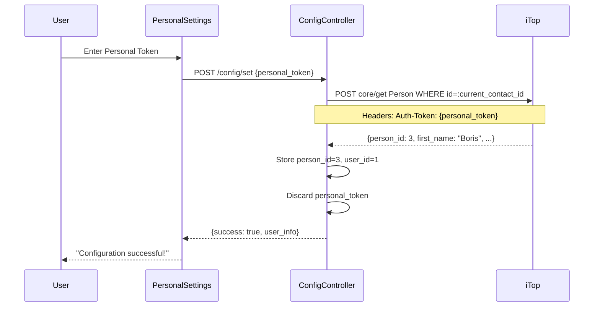
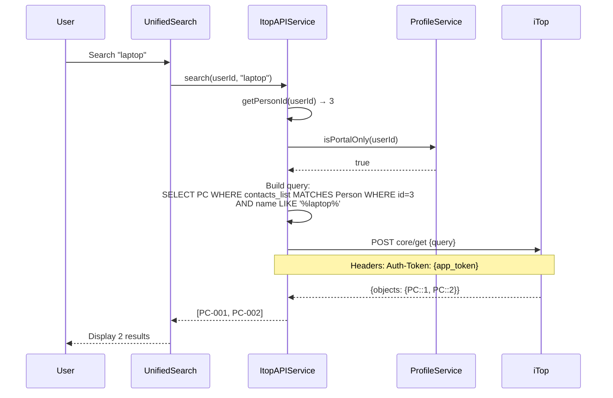
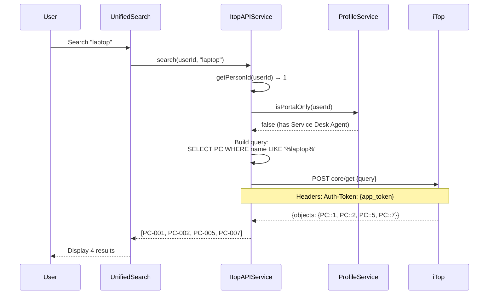
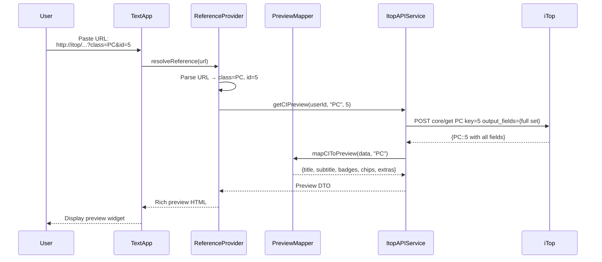

# Application Architecture

## High-Level Overview

The iTop Integration for Nextcloud follows a layered architecture with clear separation of concerns:

```
┌─────────────────────────────────────────────────────────────┐
│                    Nextcloud Frontend (Vue.js)              │
│  ┌──────────────┬──────────────┬──────────────────────────┐ │
│  │ Dashboard    │ Unified      │ Rich Preview  │ Smart    │ │
│  │ Widget       │ Search UI    │ Widgets       │ Picker   │ │
│  └──────────────┴──────────────┴──────────────────────────┘ │
└────────────────────────┬────────────────────────────────────┘
                         │ HTTP/JSON (OCS API)
┌────────────────────────▼────────────────────────────────────┐
│              Nextcloud Backend (PHP)                        │
│  ┌─────────────────────────────────────────────────────────┐│
│  │            Controllers (API Endpoints)                  ││
│  │  ┌──────────────┬────────────────┬──────────────────┐  ││
│  │  │ItopAPI       │ Config         │ (Future          │  ││
│  │  │Controller    │ Controller     │ Controllers)     │  ││
│  │  └──────────────┴────────────────┴──────────────────┘  ││
│  └─────────────────────┬───────────────────────────────────┘│
│  ┌─────────────────────▼───────────────────────────────────┐│
│  │                  Service Layer                          ││
│  │  ┌──────────────┬──────────────┬────────────────────┐  ││
│  │  │ItopAPI       │ Profile      │ PreviewMapper      │  ││
│  │  │Service       │ Service      │ (Future)           │  ││
│  │  └──────────────┴──────────────┴────────────────────┘  ││
│  └─────────────────────┬───────────────────────────────────┘│
│  ┌─────────────────────▼───────────────────────────────────┐│
│  │              Provider Layer                             ││
│  │  ┌──────────────┬──────────────┬────────────────────┐  ││
│  │  │Unified       │ Reference    │ SmartPicker        │  ││
│  │  │Search        │ Provider     │ Provider           │  ││
│  │  │Provider      │ (Future)     │ (Future)           │  ││
│  │  └──────────────┴──────────────┴────────────────────┘  ││
│  └─────────────────────────────────────────────────────────┘│
└────────────────────────┬────────────────────────────────────┘
                         │ REST API (Auth-Token header)
┌────────────────────────▼────────────────────────────────────┐
│                   iTop CMDB                                 │
│  ┌─────────────────────────────────────────────────────────┐│
│  │ REST/JSON API v1.3                                      ││
│  │  - core/get (CI queries)                                ││
│  │  - core/check_credentials (auth validation)            ││
│  │  - list_operations (capability discovery)              ││
│  └─────────────────────────────────────────────────────────┘│
└─────────────────────────────────────────────────────────────┘
```

## Component Diagram

### Backend Components

```
lib/
├── Controller/
│   ├── ItopAPIController.php       # Ticket & CI queries
│   └── ConfigController.php        # Settings management
├── Service/
│   ├── ItopAPIService.php          # Primary API client
│   ├── ProfileService.php          # User profile detection (Phase 2)
│   ├── PreviewMapper.php           # CI → DTO transformation (Phase 2)
│   └── CacheService.php            # Caching layer (Phase 2)
├── Search/
│   ├── ItopSearchProvider.php      # Current search implementation
│   └── ItopUnifiedSearchProvider.php # CI search (Phase 3)
├── Reference/
│   └── ItopReferenceProvider.php   # Rich previews (Phase 4)
├── Picker/
│   └── ItopSmartPickerProvider.php # Smart suggestions (Phase 3)
├── Dashboard/
│   └── ItopWidget.php              # Dashboard widget (current)
├── Settings/
│   ├── Admin.php                   # Admin settings UI
│   └── Personal.php                # Personal settings UI
├── Notification/
│   └── Notifier.php                # Notification handler
└── AppInfo/
    ├── Application.php             # App bootstrap
    └── routes.php                  # Route definitions
```

### Frontend Components

```
src/
├── components/
│   ├── CIPreviewWidget.vue         # Common CI preview (Phase 4)
│   ├── CISearchResult.vue          # Search result item (Phase 3)
│   └── DashboardWidget.vue         # Current dashboard
├── views/
│   ├── AdminSettings.vue           # Admin settings panel
│   └── PersonalSettings.vue        # Personal settings panel
└── main.js                         # Vue app entry point
```

## Data Flow Diagrams

### 1. User Setup Flow



### 2. CI Search Flow (Portal User)



### 3. CI Search Flow (Power User)



### 4. Rich Preview Flow



## Service Layer Architecture

### ItopAPIService

**Responsibilities:**
- Manage application token encryption/decryption
- Store and retrieve user person_id
- Execute all iTop REST API requests
- Handle authentication errors
- Log API interactions

**Key Methods:**

```php
class ItopAPIService {
    // Authentication
    private function getApplicationToken(): ?string
    private function getPersonId(string $userId): ?string

    // API Operations
    public function request(string $userId, array $params): array
    public function search(string $userId, string $query, int $offset, int $limit): array
    public function getCurrentUser(string $userId): array

    // Ticket Operations
    public function getUserCreatedTickets(string $userId, ?string $since, ?int $limit): array
    public function getUserCreatedTicketsCount(string $userId): array
    public function getTicketInfo(string $userId, int $ticketId, string $class): array

    // CI Operations (Phase 2+)
    public function getCIPreview(string $userId, string $class, int $id): array
    public function searchCIs(string $userId, string $term, array $classes): array
}
```

**Dependencies:**
- `IConfig` - Configuration storage
- `ICrypto` - Token encryption
- `IClientService` - HTTP client
- `ICacheFactory` - Result caching
- `LoggerInterface` - Logging
- `IL10N` - Internationalization

### ProfileService (Phase 2)

**Responsibilities:**
- Detect user profiles from iTop
- Determine if user is portal-only
- Cache profile information with TTL
- Handle profile changes

**Key Methods:**

```php
class ProfileService {
    public function getUserProfiles(string $userId): array
    public function isPortalOnly(string $userId): bool
    public function refreshProfiles(string $userId): void
    private function parseProfileList(array $userData): array
}
```

**Caching Strategy:**
- TTL: 300 seconds (5 minutes)
- Cache key: `profile_{userId}`
- Invalidation: Manual refresh or TTL expiry

### PreviewMapper (Phase 2)

**Responsibilities:**
- Transform iTop CI data to preview DTOs
- Apply class-specific field mappings
- Generate status badges
- Format timestamps

**Key Methods:**

```php
class PreviewMapper {
    public function mapCIToPreview(array $ciData, string $class): array
    private function getCommonFields(array $fields): array
    private function getClassSpecificFields(array $fields, string $class): array
    private function formatBadges(array $fields): array
    private function formatChips(array $fields): array
}
```

**DTO Structure:**

```php
return [
    'title' => 'LAPTOP-001',
    'subtitle' => 'PC • Demo',
    'badges' => [
        ['label' => 'Production', 'type' => 'success'],
        ['label' => 'High', 'type' => 'warning']
    ],
    'chips' => [
        ['icon' => 'building', 'label' => 'Demo'],
        ['icon' => 'map-marker', 'label' => 'Vienna Office'],
        ['icon' => 'barcode', 'label' => 'ASSET-001']
    ],
    'extras' => [
        ['label' => 'Brand', 'value' => 'Dell'],
        ['label' => 'Model', 'value' => 'Latitude 7420'],
        ['label' => 'CPU', 'value' => 'Intel i7-1185G7'],
        ['label' => 'RAM', 'value' => '16GB']
    ],
    'url' => 'http://itop/pages/UI.php?operation=details&class=PC&id=1',
    'icon' => 'PC.svg',
    'last_update' => '2025-01-15 10:30:00'
];
```

### CacheService (Phase 2)

**Responsibilities:**
- Implement distributed caching
- Manage cache TTLs
- Handle cache invalidation
- Support ETag-based caching

**Key Methods:**

```php
class CacheService {
    public function get(string $key): mixed
    public function set(string $key, mixed $value, int $ttl): void
    public function delete(string $key): void
    public function invalidateUserCache(string $userId): void
}
```

**Cache Strategy:**

| Data Type | TTL | Key Pattern | Invalidation |
|-----------|-----|-------------|--------------|
| CI Preview | 60s | `ci_preview_{userId}_{class}_{id}` | Manual or TTL |
| Search Results | 30s | `search_{userId}_{hash(query)}` | TTL only |
| Profile Data | 300s | `profile_{userId}` | Manual or TTL |
| User Info | 600s | `user_info_{userId}` | Manual or TTL |

## Provider Layer Architecture

### UnifiedSearchProvider (Phase 3)

**Interface:** `IProvider` from Nextcloud

**Responsibilities:**
- Register as search provider for "iTop CIs"
- Execute CI searches across all enabled classes
- Return formatted search results
- Respect rate limits

**Key Methods:**

```php
class ItopUnifiedSearchProvider implements IProvider {
    public function getId(): string // "itop_ci"
    public function getName(): string // "iTop Configuration Items"
    public function getOrder(string $route, array $routeParams): int
    public function search(IUser $user, ISearchQuery $query): SearchResult
}
```

**Search Result Format:**

```php
return SearchResult::complete(
    $this->getName(),
    array_map(function($ci) {
        return new SearchResultEntry(
            $ci['url'],                    // thumbnail URL (CI icon)
            $ci['name'],                   // title
            $ci['org'] . ' • ' . $ci['status'], // subline
            $ci['url'],                    // resource URL
            'icon-itop',                   // icon CSS class
            true                           // rounded
        );
    }, $results)
);
```

### ReferenceProvider (Phase 4)

**Interface:** `IReferenceProvider` from Nextcloud

**Responsibilities:**
- Detect iTop CI URLs in text
- Fetch CI data from API
- Render rich preview widgets
- Handle access permissions

**Key Methods:**

```php
class ItopReferenceProvider implements IReferenceProvider {
    public function matchReference(string $referenceText): bool
    public function resolveReference(string $referenceText): ?IReference
    public function getCachePrefix(string $referenceId): string
    public function getCacheKey(string $referenceId): ?string
    public function invalidateUserCache(string $userId): void
}
```

**URL Pattern Matching:**

```php
private const ITOP_URL_PATTERN = '/^https?:\/\/[^\/]+\/pages\/UI\.php\?.*operation=details.*class=([A-Za-z]+).*id=(\d+)/';
```

### SmartPickerProvider (Phase 3)

**Interface:** `ISmartPickerProvider` from Nextcloud

**Responsibilities:**
- Provide CI suggestions in text editors
- Debounce search queries
- Return clickable CI links
- Format suggestions with icons

**Key Methods:**

```php
class ItopSmartPickerProvider implements ISmartPickerProvider {
    public function getId(): string // "itop_ci"
    public function getName(): string // "iTop CIs"
    public function getItemIconUrl(string $itemId): string
    public function search(string $searchTerm, int $offset, int $limit): array
}
```

## Configuration Architecture

### Admin Settings

**Storage:** `oc_appconfig` table

| Key | Type | Encrypted | Description |
|-----|------|-----------|-------------|
| `admin_instance_url` | string | No | iTop base URL |
| `user_facing_name` | string | No | Display name (e.g., "iTop Dev") |
| `application_token` | string | **Yes** | Admin API token (ICrypto) |
| `enabled_ci_classes` | JSON | No | List of enabled CI classes (Phase 2) |
| `global_result_limit` | int | No | Max search results (default: 20) |

**Access:** Admin users only

### Personal Settings

**Storage:** `oc_preferences` table

| Key | Type | Description |
|-----|------|-------------|
| `person_id` | string | User's iTop Person ID (numeric) |
| `user_id` | string | User's iTop User ID (numeric) |
| `is_portal_only` | bool | Cached profile check (Phase 2) |
| `profiles_last_check` | timestamp | Last profile refresh time |
| `notification_enabled` | bool | Enable ticket notifications |
| `last_open_check` | timestamp | Last notification check |

**Access:** Per-user (isolated)

## Security Architecture

### Authentication Flow

```
┌──────────────────────────────────────────────────────────┐
│ 1. Admin Setup                                           │
│    Admin generates Application Token in iTop            │
│    ↓                                                     │
│    Admin enters token in Nextcloud Admin Settings       │
│    ↓                                                     │
│    ICrypto::encrypt(token) → Store in oc_appconfig      │
└──────────────────────────────────────────────────────────┘

┌──────────────────────────────────────────────────────────┐
│ 2. User Setup                                            │
│    User generates Personal Token in iTop                │
│    ↓                                                     │
│    User enters token in Nextcloud Personal Settings     │
│    ↓                                                     │
│    POST /config/set {personal_token}                    │
│    ↓                                                     │
│    Validate token: core/get Person :current_contact_id  │
│    ↓                                                     │
│    Extract person_id → Store in oc_preferences          │
│    ↓                                                     │
│    Discard personal_token (never stored)                │
└──────────────────────────────────────────────────────────┘

┌──────────────────────────────────────────────────────────┐
│ 3. API Request                                           │
│    User triggers search/preview                          │
│    ↓                                                     │
│    Retrieve person_id from oc_preferences                │
│    ↓                                                     │
│    Retrieve & decrypt application_token                  │
│    ↓                                                     │
│    Build OQL query filtered by person_id (if portal)    │
│    ↓                                                     │
│    POST to iTop with Auth-Token: {app_token}            │
│    ↓                                                     │
│    Return results (within user permissions)              │
└──────────────────────────────────────────────────────────┘
```

### Permission Enforcement

```php
// Pseudo-code for all CI queries
function queryCIs(userId, query) {
    personId = getPersonId(userId);
    if (!personId) throw NotConfiguredError;

    isPortalOnly = profileService.isPortalOnly(userId);

    if (isPortalOnly) {
        // Enforce contact-based filtering
        query += " AND contacts_list MATCHES Person WHERE id = " + personId;
    }
    // else: Power users get full CMDB (within ACL)

    appToken = decrypt(getApplicationToken());
    return itopAPI.request(query, appToken);
}
```

## Caching Architecture

### Cache Layers

```
┌──────────────────────────────────────────────────────────┐
│ Client-Side Cache (Browser)                              │
│  - HTTP Cache-Control headers                            │
│  - ETag support for preview images                       │
│  - TTL: 60s for previews                                 │
└──────────────────────────────────────────────────────────┘
                         ↓
┌──────────────────────────────────────────────────────────┐
│ Server-Side Cache (Redis/Memcache)                       │
│  - CI preview data (60s TTL)                             │
│  - Search results (30s TTL)                              │
│  - Profile data (300s TTL)                               │
│  - User info (600s TTL)                                  │
└──────────────────────────────────────────────────────────┘
                         ↓
┌──────────────────────────────────────────────────────────┐
│ iTop API (Source of Truth)                               │
│  - Always queried if cache miss                          │
│  - Always queried if cache expired                       │
└──────────────────────────────────────────────────────────┘
```

### Cache Invalidation Rules

- **User-triggered:** Clear cache when user updates personal settings
- **Time-based:** TTL expiry (most common)
- **Admin-triggered:** Clear all caches when admin updates application token
- **Manual:** Expose cache clear button in admin settings (Phase 2)

## Error Handling Architecture

### Error Propagation

```
iTop API Error (e.g., 401 Unauthorized)
    ↓
ItopAPIService catches ClientException
    ↓
Returns ['error' => 'Authentication failed', 'error_code' => 401]
    ↓
Controller receives error response
    ↓
Logs error (without sensitive data)
    ↓
Returns DataResponse with user-friendly message
    ↓
Frontend displays error notification
    ↓
User sees: "Could not connect to iTop - check your settings"
```

### Error Types

| Error Type | HTTP Code | User Message | Admin Action Required |
|------------|-----------|--------------|----------------------|
| Network Error | 503 | "iTop server unavailable" | Check iTop status |
| Auth Error | 401 | "Authentication failed" | Reconfigure tokens |
| Portal Block | 400 | "Portal user restriction" | Configure app token |
| Not Configured | 400 | "Please configure settings" | User action |
| Empty Results | 200 | "No results found" | None (expected) |

## Database Schema

### oc_appconfig (Admin Settings)

| Column | Type | Example |
|--------|------|---------|
| appid | varchar(255) | `integration_itop` |
| configkey | varchar(255) | `application_token` |
| configvalue | text | `{encrypted_blob}` |

### oc_preferences (User Settings)

| Column | Type | Example |
|--------|------|---------|
| userid | varchar(64) | `boris` |
| appid | varchar(255) | `integration_itop` |
| configkey | varchar(255) | `person_id` |
| configvalue | text | `3` |

## Deployment Architecture

### Production Topology

```
┌─────────────────────────────────────────────────────┐
│ Load Balancer                                       │
└────────────┬────────────────────────────────────────┘
             │
    ┌────────▼────────┬────────────────┐
    │                 │                │
┌───▼────┐      ┌────▼────┐     ┌────▼────┐
│ NC #1  │      │ NC #2   │     │ NC #3   │
│ +App   │      │ +App    │     │ +App    │
└───┬────┘      └────┬────┘     └────┬────┘
    │                │                │
    └────────┬───────┴────────────────┘
             │
    ┌────────▼────────────────────────────┐
    │ Shared Redis Cache                  │
    └─────────────────────────────────────┘
             │
    ┌────────▼────────────────────────────┐
    │ iTop Server (192.168.139.92)        │
    │ - REST API Enabled                  │
    │ - Application Token Configured      │
    └─────────────────────────────────────┘
```

### Dependencies

**Required PHP Extensions:**
- `curl` or `guzzle` (HTTP client)
- `json` (JSON parsing)
- `openssl` (ICrypto encryption)

**Nextcloud Version:**
- Minimum: 30.0
- Tested: 30.x

**iTop Version:**
- Minimum: 3.0
- Recommended: 3.1+
- API Version: 1.3

## Performance Characteristics

### Expected Latencies

| Operation | Target | Notes |
|-----------|--------|-------|
| Admin settings load | <200ms | Cached config |
| Personal settings load | <300ms | Includes user info fetch |
| Unified search (cached) | <500ms | Server-side cache hit |
| Unified search (uncached) | <2s | iTop API + processing |
| Rich preview (cached) | <300ms | Render from cache |
| Rich preview (uncached) | <1s | Single CI fetch |
| Dashboard widget | <1s | Ticket count query |

### Scalability

**Concurrent Users:** 100+ (limited by iTop API capacity)

**Request Rate:** 5 req/sec/user (recommended rate limit)

**Cache Hit Rate Target:** >80% for previews, >60% for searches

## Future Enhancements

### Phase 2 Additions

- ProfileService with cached profile detection
- PreviewMapper for CI data transformation
- CacheService with distributed caching
- Enhanced error handling and retry logic

### Phase 3+ Features

- Webhook support for real-time CI updates
- Batch API requests (if iTop 3.2+ supports)
- Offline mode with local cache
- Advanced search filters (by organization, status, etc.)

## References

- **Implementation:** [lib/Service/ItopAPIService.php](../lib/Service/ItopAPIService.php)
- **Security:** [security-auth.md](security-auth.md)
- **API Patterns:** [itop-api.md](itop-api.md)
- **Testing:** [testing.md](testing.md)
