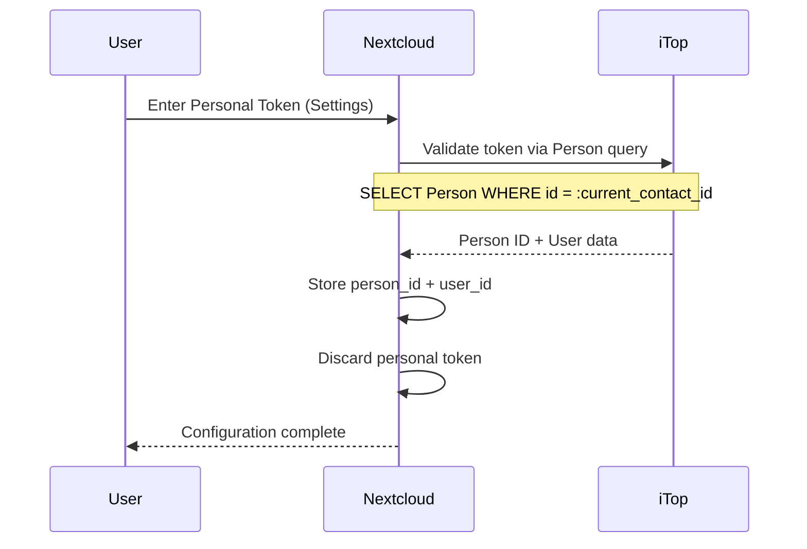
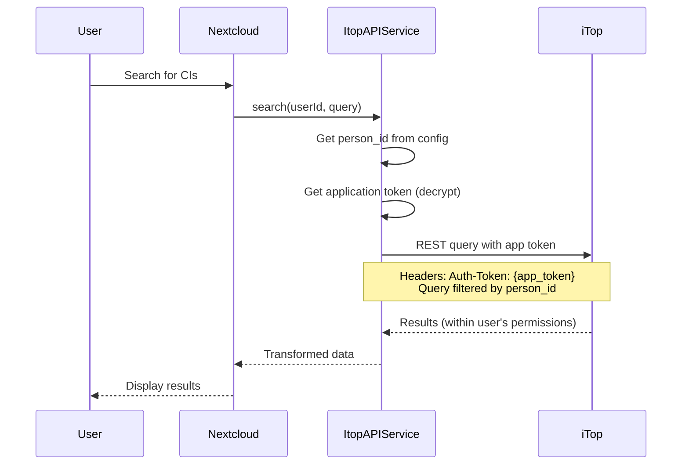

# Security & Authentication Architecture

## Overview

The iTop integration uses a **dual-token architecture** to provide secure, isolated data access while maintaining compatibility with Portal users who are blocked from direct REST API access by iTop's core restrictions.

## The Portal User Problem

### iTop's Hard Restriction

Portal users in iTop face a critical API limitation:

```php
// iTop core: webservices/rest.php line 103
$bIsAllowedToPortalUsers = false; // HARDCODED
```

**Impact:**
- Portal users **cannot** use personal API tokens for REST API access
- All requests from Portal users return: `{"code":1,"message":"Error: Portal user is not allowed"}`
- This is a core iTop restriction that cannot be bypassed without modifying iTop source code

### Why Dual-Token Architecture?

To support Portal users while maintaining security, we use two types of tokens with distinct purposes:

| Token Type | Purpose | Storage | Scope | Used For |
|-----------|---------|---------|-------|----------|
| **Personal Token** | Identity verification only | Never stored | One-time use | Proving user identity and extracting Person ID |
| **Application Token** | All API requests | Encrypted in `appconfig` | All queries | Executing all REST API operations |

## Dual-Token Flow

### Phase 1: User Setup (One-Time)



**Implementation:** [ConfigController.php:68-150](../lib/Controller/ConfigController.php#L68-L150)

```php
// Personal token validation (one-time)
private function validatePersonalTokenAndExtractPersonId(string $personalToken): array {
    // Query using personal token + iTop's magic placeholder
    $params = [
        'operation' => 'core/get',
        'class' => 'Person',
        'key' => 'SELECT Person WHERE id = :current_contact_id',
        'output_fields' => 'id,first_name,name,email,org_id_friendlyname'
    ];

    // Headers include: 'Auth-Token: ' . $personalToken
    $response = $this->request($params);

    if ($response['code'] === 0) {
        $personId = $response['objects'][0]['fields']['id'];

        // Store ONLY the Person ID (NOT the token)
        $this->config->setUserValue($userId, 'integration_itop', 'person_id', $personId);

        // Personal token is now discarded forever
        return ['success' => true, 'person_id' => $personId];
    }
}
```

### Phase 2: All Subsequent Operations



**Implementation:** [ItopAPIService.php:614-680](../lib/Service/ItopAPIService.php#L614-L680)

```php
public function request(string $userId, array $params, string $method = 'POST'): array {
    // Get application token (admin-level)
    $accessToken = $this->getApplicationToken(); // Decrypted from appconfig

    // Get stored person_id (set during one-time validation)
    $personId = $this->getPersonId($userId);

    if (!$accessToken || !$personId) {
        return ['error' => 'Not configured'];
    }

    // ALL queries use application token
    $options = [
        'headers' => [
            'Auth-Token' => $accessToken,
        ],
        'form_params' => [
            'json_data' => json_encode($params)
        ]
    ];

    return $this->client->post($url, $options);
}
```

## Permission Model

### Profile-Based Access Control

Users are categorized into two groups based on their iTop profiles:

#### 1. Portal-Only Users

**Detection:** User has ONLY "Portal user" profile (no additional profiles)

**Access Rules:**
- See ONLY CIs they are directly related to via `contacts_list` field
- No organization-based fallback
- iTop's built-in ACL still applies

**Implementation Pattern:**
```php
// Query for Portal-only users
$personId = $this->getPersonId($userId);
$query = "SELECT PC WHERE contacts_list MATCHES Person WHERE id = $personId";
```

**Example Use Case:**
- Alice (Portal user) is listed as contact on PC-001, PC-002, and Printer-005
- Alice searches for "laptop" → Only sees PC-001 and PC-002 if names match
- Alice cannot see ANY other PCs in the organization

#### 2. Power Users

**Detection:** User has ANY profile beyond "Portal user" (e.g., Service Desk Agent, Administrator, Service Manager)

**Access Rules:**
- Full CMDB search capability
- Limited only by iTop's ACL for their profiles
- No artificial filtering by contacts_list

**Implementation Pattern:**
```php
// Query for power users
$query = "SELECT PC WHERE name LIKE '%$searchTerm%'";
```

**Example Use Case:**
- Bob (Service Desk Agent + Portal user) searches for "laptop"
- Bob sees ALL laptops visible within Service Desk Agent permissions
- Bob's Portal user profile is ignored due to additional profiles

### Profile Detection Strategy

**Current Implementation:**
- Profiles are NOT currently detected/stored during setup
- This is a **Phase 2** task that needs implementation

**Planned Approach:**

```php
// Future: ProfileService.php
class ProfileService {
    public function getUserProfiles(string $userId): array {
        $personId = $this->getPersonId($userId);
        $appToken = $this->getApplicationToken();

        // Query User class with application token
        $params = [
            'operation' => 'core/get',
            'class' => 'User',
            'key' => "SELECT User WHERE contactid = $personId",
            'output_fields' => 'id,login,profile_list' // External key to UserProfile
        ];

        $result = $this->request($params);

        // Parse profile_list to extract profile names
        $profiles = $this->parseProfileList($result);

        // Store in user config with TTL cache
        return $profiles;
    }

    public function isPortalOnly(string $userId): bool {
        $profiles = $this->getUserProfiles($userId);

        // Portal-only = exactly one profile named "Portal user"
        return count($profiles) === 1 && $profiles[0] === 'Portal user';
    }
}
```

**Storage:**
```php
// Cache profile detection results
$this->config->setUserValue($userId, 'integration_itop', 'is_portal_only', $isPortalOnly ? '1' : '0');
$this->config->setUserValue($userId, 'integration_itop', 'profiles_last_check', time());
```

**TTL:** 300 seconds (5 minutes) - balance between performance and accuracy

## Token Storage & Encryption

### Application Token

**Storage Location:** `oc_appconfig` table

```sql
SELECT * FROM oc_appconfig
WHERE appid = 'integration_itop'
AND configkey = 'application_token';

-- Returns encrypted blob (not human-readable)
```

**Encryption Method:** Nextcloud's `ICrypto` service

```php
// Admin settings controller
public function setAdminConfig(array $values): DataResponse {
    if (isset($values['application_token'])) {
        $plainToken = $values['application_token'];

        // Encrypt using Nextcloud's crypto service
        $encrypted = $this->crypto->encrypt($plainToken);

        // Store encrypted value
        $this->config->setAppValue('integration_itop', 'application_token', $encrypted);
    }
}

// API service
private function getApplicationToken(): ?string {
    $encrypted = $this->config->getAppValue('integration_itop', 'application_token', '');

    if (empty($encrypted)) {
        return null;
    }

    try {
        // Decrypt on-the-fly for each request
        return $this->crypto->decrypt($encrypted);
    } catch (\Exception $e) {
        $this->logger->error('Failed to decrypt application token', ['exception' => $e]);
        return null;
    }
}
```

**Security Properties:**
- Encrypted at rest in database
- Decrypted only in memory during API requests
- Never logged in plain text
- Never sent to client-side code

### Personal Token

**Storage:** **NEVER STORED**

**Lifecycle:**
1. User enters token in personal settings
2. Token sent to `ConfigController::setConfig()`
3. Token used ONCE to validate identity and extract `person_id`
4. Token immediately discarded (not even in memory after validation)
5. Only `person_id` is stored

**Implementation:**
```php
public function setConfig(): DataResponse {
    $personalToken = $input['personal_token'] ?? null;

    if ($personalToken) {
        // ONE-TIME validation
        $validation = $this->validatePersonalTokenAndExtractPersonId($personalToken);

        if ($validation['success']) {
            // Store ONLY the person_id
            $this->config->setUserValue($userId, 'integration_itop', 'person_id', $validation['person_id']);

            // $personalToken variable goes out of scope here - NEVER stored
        }
    }

    return new DataResponse(['success' => true]);
}
```

### Person ID & User ID

**Storage Location:** `oc_preferences` table (per-user config)

```sql
SELECT * FROM oc_preferences
WHERE appid = 'integration_itop'
AND (configkey = 'person_id' OR configkey = 'user_id');

-- Sample results:
-- userid | appid            | configkey  | configvalue
-- boris  | integration_itop | person_id  | 3
-- boris  | integration_itop | user_id    | 1
```

**Security Properties:**
- Stored in plain text (not sensitive - just numeric IDs)
- Used to filter ALL API queries
- Never exposed to client-side except in user info display
- Isolates data between Nextcloud users

## Data Isolation Guarantees

### Query Filtering Strategy

Every query is automatically filtered by the authenticated user's `person_id`:

```php
// Portal-only users - Filter by contact relationship
public function searchCIs(string $userId, string $term): array {
    $personId = $this->getPersonId($userId);
    $isPortalOnly = $this->profileService->isPortalOnly($userId);

    if ($isPortalOnly) {
        // Strict filtering: Only CIs with direct contact relationship
        $query = "SELECT PC WHERE name LIKE '%$term%' "
               . "AND contacts_list MATCHES Person WHERE id = $personId";
    } else {
        // Power users: No person_id filtering (ACL only)
        $query = "SELECT PC WHERE name LIKE '%$term%' ";
    }

    return $this->request($userId, ['operation' => 'core/get', 'key' => $query]);
}
```

### Isolation Verification

**Test Case 1: Portal User Cross-Access Attempt**
- User A (Portal) has `person_id = 1`
- User B (Portal) has `person_id = 2`
- User A attempts to search for PC owned by User B's contact relationship
- **Result:** No results returned (filtered by `person_id = 1`)

**Test Case 2: Manual API Tampering**
- Attacker modifies browser request to inject different `person_id`
- `person_id` is retrieved server-side from `oc_preferences` (not from client)
- **Result:** Attack fails - queries always use server-side `person_id`

**Test Case 3: Application Token Compromise**
- Attacker gains application token
- Without valid Nextcloud session, cannot call API endpoints (`@NoAdminRequired` checks session)
- Even with session hijacking, queries filtered by victim's own `person_id`
- **Result:** Limited blast radius - attacker sees only what victim can see

## Security Best Practices

### DO's

✅ **Store only person_id, never tokens**
- Personal tokens are for identity verification only
- Application token stored encrypted

✅ **Always filter queries by person_id**
- Portal users: Filter by contacts_list relationship
- Power users: Rely on iTop ACL (but still track person_id for audit)

✅ **Use Nextcloud's ICrypto for encryption**
- Leverages Nextcloud's secret key management
- Automatic rotation compatible

✅ **Log authentication failures**
- Invalid tokens
- Missing person_id
- Profile detection failures

✅ **Cache profile checks with TTL**
- Reduces API load
- Balances freshness vs performance

### DON'Ts

❌ **Never log tokens in plain text**
```php
// BAD
$this->logger->info('Token: ' . $personalToken);

// GOOD
$this->logger->info('Token validation attempted', ['user' => $userId, 'success' => $success]);
```

❌ **Never send person_id from client**
```php
// BAD
public function search(string $userId, string $query, int $personId): array

// GOOD
public function search(string $userId, string $query): array {
    $personId = $this->getPersonId($userId); // Server-side retrieval
}
```

❌ **Never bypass profile checks**
```php
// BAD
if ($isPortalOnly && !$forceFullAccess) { ... }

// GOOD
if ($isPortalOnly) { ... } // No override mechanism
```

❌ **Never cache queries across users**
```php
// BAD
$cacheKey = 'search_' . md5($query); // Same cache for all users!

// GOOD
$cacheKey = 'search_' . $userId . '_' . md5($query); // Per-user cache
```

## Threat Model

### In Scope

| Threat | Mitigation |
|--------|-----------|
| **Portal user accessing other users' data** | Query filtering by person_id + contacts_list |
| **Token theft from database** | Application token encrypted at rest |
| **Man-in-the-middle** | HTTPS enforced (iTop requirement) |
| **Session hijacking** | Nextcloud's session management (CSRF tokens, etc.) |
| **SQL injection in OQL** | Parameterized queries + input escaping |

### Out of Scope (Delegated to iTop/Nextcloud)

| Threat | Owner |
|--------|-------|
| **iTop server compromise** | iTop administrator |
| **Nextcloud admin accessing database** | Nextcloud trust model (admins are trusted) |
| **Physical access to server** | Infrastructure security |
| **iTop ACL bypass** | iTop core security |

## Token Requirements

### Application Token (Admin Setup)

**Required iTop Profiles:**
- Administrator (for User class queries)
- REST Services User (for API access)

**Permissions Needed:**
- Read access to all CI classes (PC, Phone, etc.)
- Read access to Person class
- Read access to User class
- Read access to lnkContactToTicket (contact relationships)

**Creation in iTop:**
1. Navigate to: Data Administration → User Accounts → [Admin User]
2. Click "New Application" button
3. Name: "Nextcloud Integration"
4. Copy generated token immediately (shown only once)
5. Paste into Nextcloud Admin Settings → iTop Integration

### Personal Token (User Setup)

**Required iTop Profiles:**
- Minimum: Portal user (for identity verification)
- Personal API tokens must be enabled in iTop config: `allow_rest_services_via_tokens = true`

**Permissions Needed:**
- Read access to own Person record (via `:current_contact_id` placeholder)

**Creation in iTop:**
1. User menu → Preferences → REST Web Services
2. Click "New Token" button
3. Name: "Nextcloud" (for user reference)
4. Copy generated token
5. Paste into Nextcloud Personal Settings → iTop Integration
6. Token can be deleted after successful setup (no longer needed)

## Privacy Guarantees

### Data Minimization

**What We Store:**
- ✅ Person ID (numeric identifier)
- ✅ User ID (numeric identifier)
- ✅ iTop URL (configured by admin)
- ✅ Application token (encrypted)
- ❌ Personal tokens (never stored)
- ❌ CI data (cached briefly, see [caching-performance.md](caching-performance.md))

### User Consent

**Personal Settings Flow:**
1. User sees explanation of what access is granted
2. User creates and enters personal token (explicit action)
3. User confirms setup
4. User can revoke at any time (delete token in settings)

**Implications of Revocation:**
- Deleting personal token in Nextcloud settings removes `person_id`
- All iTop integration features stop working for that user
- No residual access to iTop data

### Audit Trail

**Logged Events:**
- Personal token validation attempts (success/failure)
- Application token configuration changes
- API request errors (without sensitive data)
- Profile detection failures

**NOT Logged:**
- Token values (encrypted or plain)
- CI content (PII data from iTop)
- User search queries (privacy)

## Compliance Considerations

### GDPR

**Right to Access:**
- User can view their stored `person_id` in personal settings
- CI data is fetched live from iTop (not stored in Nextcloud)

**Right to Erasure:**
- User can delete their `person_id` in settings
- No personal data persists in Nextcloud after deletion
- CI data remains in iTop (managed separately)

**Data Controller:**
- Nextcloud stores minimal identifiers only
- iTop is the primary data controller for CI data
- Integration acts as data processor

### Security Audits

**Key Verification Points:**
1. Verify application token is encrypted in database
2. Verify personal tokens never appear in database dumps
3. Verify query filtering by person_id for Portal users
4. Verify no cross-user cache pollution
5. Verify logs don't contain token values

## Future Enhancements

### Planned (Phase 2+)

- [ ] **Profile caching** - Store and refresh user profiles every 5 minutes
- [ ] **Token rotation support** - Handle application token updates gracefully
- [ ] **Multi-tenancy** - Support multiple iTop instances per Nextcloud
- [ ] **Rate limiting** - Per-user API rate limits (see [caching-performance.md](caching-performance.md))

### Considered (Future Versions)

- [ ] **OAuth 2.0 flow** - If iTop adds OAuth support
- [ ] **SSO integration** - Automatic person_id detection via SAML attributes
- [ ] **Delegation** - Allow power users to view as portal users (support scenarios)

## References

- **Implementation:** [ItopAPIService.php](../lib/Service/ItopAPIService.php)
- **Config Controller:** [ConfigController.php](../lib/Controller/ConfigController.php)
- **iTop REST API Docs:** https://www.itophub.io/wiki/page?id=latest:advancedtopics:rest_json
- **Nextcloud Crypto Service:** https://docs.nextcloud.com/server/latest/developer_manual/basics/security.html
