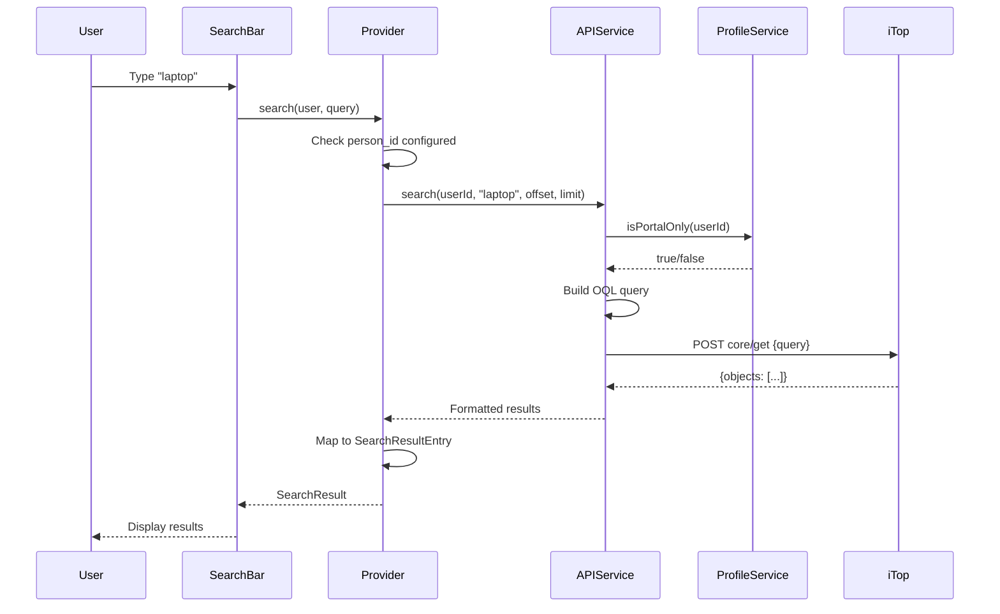

# Unified Search - Search Provider Specification

## Overview

The Unified Search integration enables users to search iTop tickets and Configuration Items directly from Nextcloud's global search bar. Results appear alongside files, contacts, and other Nextcloud content, providing seamless access to ITSM data without leaving the Nextcloud interface.

## Architecture

### Search Provider

**Class:** `OCA\Itop\Search\ItopSearchProvider`
**Interface:** `OCP\Search\IProvider`
**Location:** `lib/Search/ItopSearchProvider.php`

**Responsibilities:**
- Register as Nextcloud unified search provider
- Execute search queries against iTop API
- Format and rank results
- Apply user permission filters
- Handle pagination
- Provide localized result descriptions

## Provider Registration

### Configuration

**Provider Identifier:** `integration_itop`

**Display Name:**
```php
public function getName(): string {
    $displayName = $this->config->getAppValue(Application::APP_ID, 'user_facing_name', 'iTop');
    return $displayName;
}
```

**Use Case:** Admin configures display name as "iTop Dev" → Search results show under "iTop Dev" category

### Search Order

**Dynamic Ordering Based on Context:**

```php
public function getOrder(string $route, array $routeParameters): int {
    if (strpos($route, Application::APP_ID . '.') === 0) {
        // Active app: prefer iTop results
        return -1; // Higher priority
    }

    return 20; // Default: below files, contacts
}
```

**Examples:**
- User viewing iTop dashboard → iTop results appear first
- User viewing Files app → iTop results appear after files
- User on Talk page → iTop results appear in standard position

### Opt-Out Configuration

**User Preference:**
```php
$searchEnabled = $this->config->getUserValue(
    $userId,
    Application::APP_ID,
    'search_enabled',
    '1' // Default: enabled
) === '1';

if (!$searchEnabled) {
    return SearchResult::complete($this->getName(), []);
}
```

**Settings Location:** Personal Settings → iTop Integration → Enable search

## Search Query Construction

### Query Execution Flow



### For Portal Users

**Profile Detection:**
```php
$personId = $this->getPersonId($userId);
$isPortalOnly = $this->profileService->isPortalOnly($userId);
```

**Query Construction:**
```php
if ($isPortalOnly) {
    // Restrict to contact-related tickets/CIs
    $query = "SELECT UserRequest WHERE "
           . "contacts_list MATCHES Person WHERE id = $personId "
           . "AND title LIKE '%$escapedTerm%' "
           . "LIMIT $limit";
}
```

**Example:**
```
User: boris (Portal user, person_id = 3)
Search term: "laptop"

OQL Query:
SELECT UserRequest
WHERE contacts_list MATCHES Person WHERE id = 3
AND title LIKE '%laptop%'
LIMIT 20

Results: Only tickets where boris is listed as contact
```

### For Power Users

**Profile Detection:**
```php
$isPortalOnly = $this->profileService->isPortalOnly($userId);
// Returns false if user has Service Desk Agent, Administrator, etc.
```

**Query Construction:**
```php
if (!$isPortalOnly) {
    // Full CMDB search (within iTop ACL)
    $query = "SELECT UserRequest WHERE title LIKE '%$escapedTerm%' LIMIT $limit";
}
```

**Example:**
```
User: agent (Service Desk Agent, person_id = 1)
Search term: "laptop"

OQL Query:
SELECT UserRequest
WHERE title LIKE '%laptop%'
LIMIT 20

Results: All tickets matching "laptop" visible to Service Desk Agent profile
```

### Multi-Class Search

**Current Implementation (Tickets Only):**
```php
// Search UserRequest
$userRequests = $this->searchClass('UserRequest', $term, $limit / 2);

// Search Incident
$incidents = $this->searchClass('Incident', $term, $limit / 2);

// Merge and sort
$results = array_merge($userRequests, $incidents);
usort($results, fn($a, $b) => $b['last_update'] <=> $a['last_update']);
```

**Phase 2: CI Search (Planned):**
```php
$enabledClasses = [
    'PC', 'Phone', 'IPPhone', 'MobilePhone', 'Tablet',
    'Printer', 'Peripheral',
    'PCSoftware', 'OtherSoftware', 'WebApplication'
];

// Calculate per-class limit for round-robin distribution
$perClassLimit = ceil($globalLimit / count($enabledClasses));

// Polymorphic query across all CI classes
$query = "SELECT FunctionalCI WHERE "
       . "finalclass IN ('" . implode("','", $enabledClasses) . "') "
       . "AND name LIKE '%$escapedTerm%' "
       . ($isPortalOnly ? "AND contacts_list MATCHES Person WHERE id = $personId " : "")
       . "LIMIT " . ($perClassLimit * count($enabledClasses));
```

**Benefits:**
- Single API call for all CI classes
- Efficient database query
- Consistent result ordering

### Search Field Mapping

**Tickets (UserRequest, Incident):**
```php
$searchFields = [
    'title',        // Primary: ticket title
    'ref',          // Secondary: ticket reference (R-000123)
    'description',  // Tertiary: full description
    'caller_id_friendlyname', // Caller name
];

// OQL WHERE clause
$conditions = array_map(
    fn($field) => "$field LIKE '%$escapedTerm%'",
    $searchFields
);
$where = implode(' OR ', $conditions);
```

**CIs (Phase 2):**
```php
$searchFields = [
    'name',         // Primary: CI name
    'asset_number', // Asset tag
    'serialnumber', // Serial number
    'description',  // Description
];

// Class-specific additions
if ($class === 'PC') {
    $searchFields[] = 'osfamily_id_friendlyname'; // OS type
    $searchFields[] = 'brand_id_friendlyname';    // Brand name
}
if ($class === 'WebApplication') {
    $searchFields[] = 'url'; // Application URL
}
```

### Query Escaping

**Critical Security Measure:**

```php
private function escapeOQL(string $userInput): string {
    // Escape single quotes for OQL injection prevention
    return str_replace("'", "\\'", $userInput);
}
```

**Example:**
```php
User input: "Alice's Laptop"
Escaped: "Alice\\'s Laptop"
Query: SELECT PC WHERE name LIKE '%Alice\\'s Laptop%'
```

**See:** [security-auth.md](security-auth.md) for full security details

## Result Ranking and Formatting

### Ranking Strategy

**Current Implementation (Time-Based):**
```php
usort($results, function($a, $b) {
    return $b['last_update'] <=> $a['last_update'];
});
```

**Results ordered by:** Most recently updated first

**Phase 2: Weighted Ranking (Planned):**

| Factor | Weight | Example |
|--------|--------|---------|
| Exact title match | 100 | "Laptop" matches "Laptop-001" exactly |
| Title starts with term | 80 | "Laptop" matches "Laptop HP" |
| Title contains term | 60 | "Laptop" matches "Old Laptop" |
| Description contains term | 40 | "Laptop" in description |
| Reference match | 90 | "R-123" matches "R-000123" |
| Recent update (bonus) | +10 | Updated within 7 days |

**Implementation:**
```php
private function calculateRelevanceScore(array $ticket, string $term): int {
    $score = 0;
    $term = strtolower($term);

    // Title exact match
    if (strtolower($ticket['title']) === $term) {
        $score += 100;
    }
    // Title starts with
    elseif (stripos($ticket['title'], $term) === 0) {
        $score += 80;
    }
    // Title contains
    elseif (stripos($ticket['title'], $term) !== false) {
        $score += 60;
    }

    // Reference match
    if (stripos($ticket['ref'], $term) !== false) {
        $score += 90;
    }

    // Description contains
    if (stripos($ticket['description'], $term) !== false) {
        $score += 40;
    }

    // Recent update bonus
    $lastUpdate = strtotime($ticket['last_update']);
    $weekAgo = time() - (7 * 24 * 60 * 60);
    if ($lastUpdate > $weekAgo) {
        $score += 10;
    }

    return $score;
}

usort($results, fn($a, $b) => $b['score'] <=> $a['score']);
```

### Result Entry Format

**SearchResultEntry Structure:**

```php
new ItopSearchResultEntry(
    $thumbnailUrl,  // Icon URL (empty for text-only)
    $title,         // Main title with emoji + ref
    $subline,       // Description with metadata
    $resourceUrl,   // Link to iTop
    $iconCss,       // CSS class for icon
    $rounded        // Icon shape (true = rounded)
);
```

**Title Formatting:**

```php
$statusEmoji = $this->getStatusEmoji($entry['status']);
$title = $statusEmoji . ' [' . $entry['ref'] . '] ' . $entry['title'];

// Examples:
// "🆕 [R-000123] Laptop running slow"
// "👥 [I-000456] Network outage"
// "✅ [R-000789] Request new monitor"
```

**Status Emoji Mapping:**

| Status | Emoji | Label |
|--------|-------|-------|
| `new` | 🆕 | New |
| `assigned` | 👥 | Assigned |
| `pending` | ⏳ | Pending |
| `resolved` | ✅ | Resolved |
| `closed` | ☑️ | Closed |
| `escalated_tto`, `escalated_ttr` | ⚠️ | Escalated |
| Default | ⚪ | Unknown |

**Subline Formatting (Description):**

```php
protected function formatDescription(array $entry): string {
    $parts = [];

    // Priority with emoji
    if (!empty($entry['priority'])) {
        $priorityEmoji = $this->getPriorityEmoji($entry['priority']);
        $parts[] = $priorityEmoji . ' P' . $entry['priority'];
    }

    // Agent assignment
    if (!empty($entry['agent'])) {
        $parts[] = '👤 ' . $this->truncate($entry['agent'], 20);
    }

    // Timestamp
    $timeInfo = $this->getTimeInfo($entry);
    if ($timeInfo) {
        $parts[] = $timeInfo;
    }

    // Description snippet
    if (!empty($entry['description'])) {
        $description = strip_tags($entry['description']);
        if (strlen($description) > 150) {
            $description = substr($description, 0, 147) . '...';
        }
        $parts[] = $description;
    }

    return implode(' • ', $parts);
}

// Example output:
// "🟠 P2 • 👤 Jane Smith • 🕐 updated 2h ago • My laptop has been running..."
```

**Priority Emoji Mapping:**

| Priority | Emoji | Label |
|----------|-------|-------|
| `1` | 🔴 | Critical |
| `2` | 🟠 | High |
| `3` | 🟡 | Medium |
| `4` | 🟢 | Low |
| Default | ⚪ | Unknown |

### Time Information

**Precise Time Formatting:**

```php
private function formatPreciseTime(DateTime $dateTime): string {
    $now = new DateTime();
    $diff = $now->getTimestamp() - $dateTime->getTimestamp();

    // < 1 minute
    if ($diff < 60) {
        return 'just now';
    }

    // < 1 hour - show minutes
    if ($diff < 3600) {
        $minutes = floor($diff / 60);
        return $minutes . 'min ago';
    }

    // < 24 hours - show hours + minutes
    if ($diff < 86400) {
        $hours = floor($diff / 3600);
        $minutes = floor(($diff % 3600) / 60);
        return $minutes > 0
            ? $hours . 'h ' . $minutes . 'min ago'
            : $hours . 'h ago';
    }

    // < 7 days - show days + hours
    if ($diff < 604800) {
        $days = floor($diff / 86400);
        $hours = floor(($diff % 86400) / 3600);
        return $hours > 0
            ? $days . 'd ' . $hours . 'h ago'
            : $days . 'd ago';
    }

    // < 30 days - show days
    if ($diff < 2592000) {
        $days = floor($diff / 86400);
        return $days . ' days ago';
    }

    // > 30 days - show actual date
    return $this->dateTimeFormatter->formatDate($dateTime, 'short');
}
```

**Priority Selection (Closed vs Active):**

```php
private function getTimeInfo(array $entry): ?string {
    // Closed tickets - show close date
    if (!empty($entry['close_date'])) {
        $dateTime = DateTime::createFromFormat('Y-m-d H:i:s', $entry['close_date']);
        $time = $this->formatPreciseTime($dateTime);
        return '🏁 ' . $this->l10n->t('closed %s', [$time]);
    }

    // Active tickets - show last update
    if (!empty($entry['last_update'])) {
        $dateTime = DateTime::createFromFormat('Y-m-d H:i:s', $entry['last_update']);
        $time = $this->formatPreciseTime($dateTime);
        return '🕐 ' . $this->l10n->t('updated %s', [$time]);
    }

    // New tickets - show start date
    if (!empty($entry['start_date'])) {
        $dateTime = DateTime::createFromFormat('Y-m-d H:i:s', $entry['start_date']);
        $time = $this->formatPreciseTime($dateTime);
        return '🆕 ' . $this->l10n->t('created %s', [$time]);
    }

    return null;
}
```

### Icon Selection

**Ticket Icons:**

```php
protected function getIconUrl(string $type): string {
    switch ($type) {
        case 'UserRequest':
            return $this->urlGenerator->imagePath(Application::APP_ID, 'ticket.svg');
        case 'Incident':
            return $this->urlGenerator->imagePath(Application::APP_ID, 'ticket.svg');
        case 'FunctionalCI':
            return $this->urlGenerator->imagePath(Application::APP_ID, 'ci.svg');
        default:
            return $this->urlGenerator->imagePath(Application::APP_ID, 'app.svg');
    }
}
```

**CI Icons (Phase 2):**

```php
$iconMap = [
    'PC' => 'PC.svg',
    'Phone' => 'Phone.svg',
    'IPPhone' => 'Phone.svg',
    'MobilePhone' => 'Phone.svg',
    'Tablet' => 'Tablet.svg',
    'Printer' => 'Printer.svg',
    'Peripheral' => 'Peripheral.svg',
    'PCSoftware' => 'PCSoftware.svg',
    'OtherSoftware' => 'Software.svg',
    'WebApplication' => 'WebApplication.svg',
];

return $this->urlGenerator->imagePath(
    Application::APP_ID,
    $iconMap[$class] ?? 'FunctionalCI.svg'
);
```

## Per-Class Search Strategies

### Ticket Search (Current)

**UserRequest:**
```php
$outputFields = [
    'id', 'ref', 'title', 'description',
    'status', 'priority',
    'caller_id_friendlyname',
    'agent_id_friendlyname',
    'org_name',
    'creation_date', 'last_update', 'close_date', 'start_date'
];

$query = "SELECT UserRequest WHERE "
       . "title LIKE '%$term%' OR description LIKE '%$term%' OR ref LIKE '%$term%' "
       . ($isPortalOnly ? "AND caller_id = $personId " : "")
       . "ORDER BY last_update DESC "
       . "LIMIT $limit";
```

**Incident:**
```php
// Same structure as UserRequest
$query = "SELECT Incident WHERE "
       . "title LIKE '%$term%' OR description LIKE '%$term%' OR ref LIKE '%$term%' "
       . ($isPortalOnly ? "AND caller_id = $personId " : "")
       . "ORDER BY last_update DESC "
       . "LIMIT $limit";
```

### CI Search (Phase 2)

**PC:**
```php
$outputFields = [
    'id', 'name', 'finalclass',
    'org_id_friendlyname', 'status',
    'asset_number', 'serialnumber',
    'brand_id_friendlyname', 'model_id_friendlyname',
    'type', 'osfamily_id_friendlyname', // PC-specific
    'last_update'
];

$query = "SELECT PC WHERE "
       . "(name LIKE '%$term%' OR asset_number LIKE '%$term%' OR serialnumber LIKE '%$term%' "
       . "OR brand_id_friendlyname LIKE '%$term%' OR osfamily_id_friendlyname LIKE '%$term%') "
       . ($isPortalOnly ? "AND contacts_list MATCHES Person WHERE id = $personId " : "")
       . "LIMIT $limit";
```

**Phone/MobilePhone:**
```php
$outputFields = [
    'id', 'name', 'finalclass',
    'org_id_friendlyname', 'status',
    'asset_number', 'serialnumber',
    'phonenumber', // Phone-specific
    'imei',        // MobilePhone-specific
    'last_update'
];

$query = "SELECT Phone WHERE "
       . "(name LIKE '%$term%' OR phonenumber LIKE '%$term%' OR asset_number LIKE '%$term%') "
       . ($isPortalOnly ? "AND contacts_list MATCHES Person WHERE id = $personId " : "")
       . "LIMIT $limit";
```

**WebApplication:**
```php
$outputFields = [
    'id', 'name', 'finalclass',
    'org_id_friendlyname', 'status',
    'url',            // WebApp-specific
    'webserver_name', // WebApp-specific
    'last_update'
];

$query = "SELECT WebApplication WHERE "
       . "(name LIKE '%$term%' OR url LIKE '%$term%' OR webserver_name LIKE '%$term%') "
       . ($isPortalOnly ? "AND contacts_list MATCHES Person WHERE id = $personId " : "")
       . "LIMIT $limit";
```

### Search Weight Per Class

**Configurable Weights (Phase 2):**

```php
$classWeights = [
    'UserRequest' => 100,  // Highest priority
    'Incident' => 95,      // High priority
    'PC' => 80,            // Medium-high (commonly searched)
    'Phone' => 70,         // Medium
    'WebApplication' => 75, // Medium-high
    'Printer' => 60,       // Medium-low
    'Tablet' => 65,        // Medium
    'PCSoftware' => 50,    // Lower (less frequently searched)
];

// Apply class weight to relevance score
$finalScore = $relevanceScore * ($classWeights[$class] / 100);
```

**Use Case:** Boost ticket results over CIs in mixed searches

## Portal vs Power User Filtering

### Detection Logic

**ProfileService (Phase 2):**

```php
class ProfileService {
    public function isPortalOnly(string $userId): bool {
        $profiles = $this->getUserProfiles($userId);

        // Portal-only = exactly one profile named "Portal user"
        return count($profiles) === 1 && $profiles[0] === 'Portal user';
    }

    private function getUserProfiles(string $userId): array {
        // Check cache first
        $cacheKey = 'profile_' . $userId;
        $cached = $this->cache->get($cacheKey);
        if ($cached !== null) {
            return json_decode($cached, true);
        }

        // Fetch from iTop User class
        $personId = $this->getPersonId($userId);
        $appToken = $this->getApplicationToken();

        $params = [
            'operation' => 'core/get',
            'class' => 'User',
            'key' => "SELECT User WHERE contactid = $personId",
            'output_fields' => 'id,login,profile_list'
        ];

        $result = $this->request($params);
        $profiles = $this->parseProfileList($result);

        // Cache for 5 minutes
        $this->cache->set($cacheKey, json_encode($profiles), 300);

        return $profiles;
    }
}
```

### Query Filters

**Portal User Query (Tickets):**
```sql
SELECT UserRequest
WHERE title LIKE '%laptop%'
AND caller_id = 3  -- Only tickets created by this user
LIMIT 20
```

**Portal User Query (CIs):**
```sql
SELECT PC
WHERE name LIKE '%laptop%'
AND contacts_list MATCHES Person WHERE id = 3  -- Only CIs with user as contact
LIMIT 20
```

**Power User Query (Tickets):**
```sql
SELECT UserRequest
WHERE title LIKE '%laptop%'
-- No caller filter - all tickets visible to profile
LIMIT 20
```

**Power User Query (CIs):**
```sql
SELECT PC
WHERE name LIKE '%laptop%'
-- No contacts filter - full CMDB access
LIMIT 20
```

### Access Control Edge Cases

**Scenario 1: Portal User Searches for Other User's Ticket**

```
User: boris (Portal user, person_id = 3)
Search: "Alice's laptop"
Tickets in iTop:
  - R-000123: "Alice's laptop issue" (caller_id = 5, alice)
  - R-000456: "Boris laptop issue" (caller_id = 3, boris)

Query: SELECT UserRequest WHERE title LIKE '%Alice\\'s laptop%' AND caller_id = 3
Result: R-000456 only (caller_id matches boris)
```

**Scenario 2: Power User Searches Across All Tickets**

```
User: agent (Service Desk Agent, person_id = 1)
Search: "Alice's laptop"

Query: SELECT UserRequest WHERE title LIKE '%Alice\\'s laptop%'
Result: R-000123, R-000456 (both visible to Service Desk Agent)
```

## Performance Optimization

### Result Limits

**Global Limit:**
```php
private const GLOBAL_RESULT_LIMIT = 20; // Configurable in admin settings
```

**Per-Class Distribution:**
```php
$enabledClasses = ['PC', 'Phone', 'Tablet', 'Printer', 'WebApplication'];
$perClassLimit = ceil($globalLimit / count($enabledClasses));

// Example: 20 results / 5 classes = 4 per class
```

**Round-Robin Collection:**
```php
$results = [];
foreach ($enabledClasses as $class) {
    $classResults = $this->searchClass($class, $term, $perClassLimit);
    $results = array_merge($results, $classResults);

    if (count($results) >= $globalLimit) {
        break;
    }
}

// Trim to global limit
$results = array_slice($results, 0, $globalLimit);
```

### Pagination

**Nextcloud Pagination Interface:**

```php
public function search(IUser $user, ISearchQuery $query): SearchResult {
    $term = $query->getTerm();
    $offset = (int) $query->getCursor(); // Current page offset
    $limit = $query->getLimit();         // Results per page

    $searchResults = $this->itopAPIService->search($userId, $term, $offset, $limit);

    if (count($searchResults) < $limit) {
        // No more results - mark as complete
        return SearchResult::complete($this->getName(), $formattedResults);
    }

    // More results available - return next cursor
    return SearchResult::paginated($this->getName(), $formattedResults, $offset + $limit);
}
```

**Example Flow:**
```
Page 1: offset=0, limit=20 → Returns 20 results, cursor=20
Page 2: offset=20, limit=20 → Returns 15 results, cursor=null (complete)
```

### Caching Strategy

**Cache Key Pattern:**
```php
$cacheKey = 'search_' . $userId . '_' . md5($term . '_' . $offset . '_' . $limit);
```

**TTL:** 30 seconds (balances freshness vs performance)

**Implementation:**
```php
public function search(IUser $user, ISearchQuery $query): SearchResult {
    $cacheKey = $this->getCacheKey($userId, $term, $offset, $limit);
    $cached = $this->cache->get($cacheKey);

    if ($cached !== null) {
        return SearchResult::complete($this->getName(), json_decode($cached, true));
    }

    $results = $this->itopAPIService->search($userId, $term, $offset, $limit);
    $formattedResults = $this->formatResults($results);

    $this->cache->set($cacheKey, json_encode($formattedResults), 30);

    return SearchResult::complete($this->getName(), $formattedResults);
}
```

### Debouncing (Client-Side)

**Nextcloud handles debouncing automatically:**
- User types in search bar
- Nextcloud waits 300ms after last keystroke
- Then triggers provider search

**No server-side debouncing needed**

### Query Optimization

**Minimize Output Fields:**
```php
// Lightweight list fields (see class-mapping.md)
$listFields = [
    'id', 'name', 'finalclass',
    'org_id_friendlyname', 'status',
    'asset_number', 'serialnumber',
    'last_update'
];

// NOT full preview fields (reduces payload by ~60%)
```

**Use Database Indexes:**
- Ensure iTop has indexes on `title`, `name`, `ref`, `asset_number`
- `LIKE '%term%'` is slow but necessary for flexible matching
- Consider iTop full-text search if available

**Limit Per-Class Results:**
```php
// Fetch 5 per class, not 20 per class
// Reduces API load when searching multiple classes
```

## Error Handling

### Empty Results

**Graceful Degradation:**
```php
if (empty($searchResults) || isset($searchResults['error'])) {
    return SearchResult::complete($this->getName(), []);
}
```

**User Experience:**
- No error message shown
- Search section simply doesn't appear
- Other providers (files, contacts) still show results

### API Errors

**Error Logging:**
```php
if (isset($searchResults['error'])) {
    $this->logger->error('Error searching iTop: ' . $searchResults['error'], [
        'app' => Application::APP_ID,
        'user' => $userId
    ]);
    return SearchResult::complete($this->getName(), []);
}
```

**Common Errors:**
- Network timeout → Empty results
- Invalid token → Empty results (user should check settings)
- iTop server down → Empty results

### User Not Configured

**Early Exit:**
```php
$personId = $this->config->getUserValue($userId, Application::APP_ID, 'person_id', '');
if ($personId === '') {
    return SearchResult::complete($this->getName(), []);
}
```

**User Experience:**
- No search results shown
- User should configure personal settings first

## Internationalization

### Translatable Strings

**Provider Name:**
```php
// Display name comes from admin config (not translatable)
$displayName = $this->config->getAppValue(Application::APP_ID, 'user_facing_name', 'iTop');
```

**Time Formatting:**
```php
$this->l10n->t('closed %s', [$time])
$this->l10n->t('updated %s', [$time])
$this->l10n->t('created %s', [$time])
```

**Status Labels:**
```php
// Use iTop's localized status values directly
// No translation needed (iTop already provides localized strings)
```

## Testing

### Manual Testing

**Test Case 1: Basic Search**
1. Open Nextcloud search bar (Ctrl+K or Cmd+K)
2. Type "laptop"
3. Verify iTop results appear under "iTop" section
4. Verify emoji, ref, title, status visible
5. Click result → Opens in iTop

**Test Case 2: Portal User Restriction**
1. Login as portal user (boris)
2. Search for ticket not created by boris
3. Verify no results (or only boris's tickets)
4. Search for boris's own ticket
5. Verify result appears

**Test Case 3: Empty Results**
1. Search for "xyz123nonexistent"
2. Verify iTop section doesn't appear (graceful)
3. Verify no error messages

**Test Case 4: Pagination**
1. Search for common term (e.g., "ticket")
2. Scroll to bottom of results
3. Click "Show more" (if available)
4. Verify next page loads

### Automated Tests

**Unit Tests:**
```php
class ItopSearchProviderTest extends TestCase {
    public function testFormatDescription() {
        $entry = [
            'priority' => '2',
            'agent' => 'Jane Smith',
            'last_update' => '2025-10-18 14:30:00',
            'description' => 'This is a long description...'
        ];

        $description = $provider->formatDescription($entry);

        $this->assertStringContainsString('🟠', $description);
        $this->assertStringContainsString('P2', $description);
        $this->assertStringContainsString('Jane Smith', $description);
    }

    public function testGetStatusEmoji() {
        $this->assertEquals('🆕', $provider->getStatusEmoji('new'));
        $this->assertEquals('✅', $provider->getStatusEmoji('resolved'));
        $this->assertEquals('⏳', $provider->getStatusEmoji('pending'));
    }
}
```

**Integration Tests:**
```php
public function testSearch() {
    $searchQuery = $this->createMock(ISearchQuery::class);
    $searchQuery->method('getTerm')->willReturn('laptop');
    $searchQuery->method('getCursor')->willReturn(0);
    $searchQuery->method('getLimit')->willReturn(20);

    $user = $this->createMock(IUser::class);
    $user->method('getUID')->willReturn('boris');

    $result = $provider->search($user, $searchQuery);

    $this->assertInstanceOf(SearchResult::class, $result);
    $this->assertGreaterThan(0, count($result->getEntries()));
}
```

## Future Enhancements

### Phase 2 Additions

- [ ] CI search support (PC, Phone, Tablet, etc.)
- [ ] Weighted relevance scoring
- [ ] Class-specific search field mapping
- [ ] Per-class result limits
- [ ] Admin-configurable class weights

### Phase 3+ Features

- [ ] Faceted search (filter by status, priority, org)
- [ ] Saved searches
- [ ] Search suggestions ("Did you mean...")
- [ ] Advanced search syntax (`status:new priority:1`)
- [ ] Search within search (refine results)

## References

- **Implementation:** [lib/Search/ItopSearchProvider.php](../lib/Search/ItopSearchProvider.php)
- **API Integration:** [itop-api.md](itop-api.md)
- **Security:** [security-auth.md](security-auth.md)
- **Class Mapping:** [class-mapping.md](class-mapping.md)
- **Nextcloud Search API:** https://docs.nextcloud.com/server/latest/developer_manual/digging_deeper/search.html
